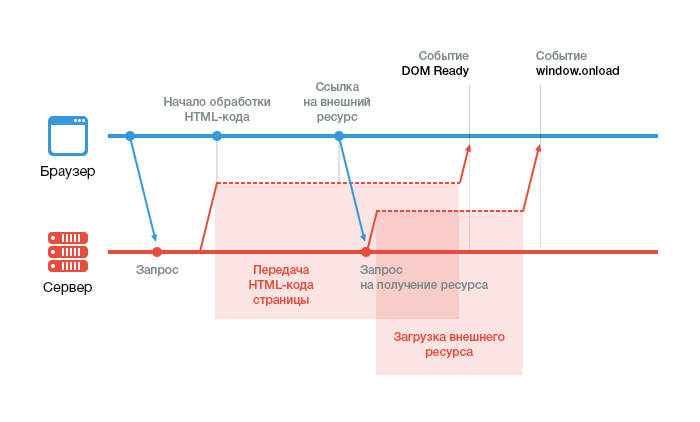

# Прелоадер до полной загрузки веб-страницы

В зависимости от типа веб-ресурса и объема информации на нем, загрузка сайта может занять от нескольких миллисекунд до пары секунд. В процессе загрузки с сайтом может происходить множество вещей: верстка может прыгать в разные стороны, текст может менять начертание. Возникает вполне закономерное желание спрятать всю эту вакханалию подальше от глаз посетителей. Для этого и предназначены прелоадеры.

Прелоадер — это индикатор загрузки сайта. Он может быть выполнен как в виде анимированного gif-изображения, так и в виде шкалы загрузки. Но независимо от внешнего вида прелоадера, принцип его работы будет одним и тем же: как можно раньше показать пользователю индикатор загрузки, а по окончании загрузки этот индикатор скрыть.

## Как загружается веб-страница

Прежде чем создать индикатор какого бы то ни было процесса, нужно разобраться в самом процессе. Загрузка веб-страниц — не исключение. Итак, как же загружается веб-страница?

1. Браузер отправляет запрос на сервер.
2. Сервер начинает отправлять браузеру html-код страницы. Специфика передачи данных в интернете такова, что код страницы браузер получает не сразу, а по частям.
3. В целях экономии времени браузер начинает обработку html-кода страницы, не дожидаясь окончания документа.
4. Как только в коде страницы браузер встречает внешний ресурс, он отправляет на сервер запрос на получение этого ресурса. При этом, в большинстве случаев, если этот ресурс — javascript-файл, то дальнейшая обработка страницы прекращается до полной загрузки и выполнения javascript-кода этого файла.
5. Как только браузер полностью получил и обработал html-код страницы (обработчик достиг закрытия тега `html`), браузер вызывает событие `DOMContentLoaded`, также известное как `DOM Ready`.
6. Как только последний внешний ресурс загружен, браузер вызывает событие `window.onload`. Страница полностью загружена.



## Процесс создания

Теперь, понимая порядок загрузки веб-страницы, можно сформировать для себя список задач и условий для нашего прелоадера. Мои условия для него таковы:

Должен отображаться как можно раньше, закрывая собой весь контент. По возможности, отображение не должно зависеть от внешних ресурсов.
Должен скрываться, как только загрузка страницы полностью завершена. Для скрытия можно использовать любую доступную javascript-библиотеку.
Если ваша страница практически не зависит от графики, то вместо window.onload для скрытия прелоадера можно использовать DOM Ready.

Для решения первой задачи поместим следующий html-код сразу после открывающего тега `body`:

```html
<div id="page-preloader"><span class="spinner"></span></div>
```

Для нашего прелоадера нам понадобятся стили, но зависить от внешних файлов мы не хотим, поэтому разместим стили прямо в документе, где-нибудь внутри head:

```css
#page-preloader {
    position: fixed;
    left: 0;
    top: 0;
    right: 0;
    bottom: 0;
    background: #000;
    z-index: 100500;
}

#page-preloader .spinner {
    width: 32px;
    height: 32px;
    position: absolute;
    left: 50%;
    top: 50%;
    background: url('/img/spinner.gif') no-repeat 50% 50%;
    margin: -16px 0 0 -16px;
}
```

К сожалению, полностью отказаться от внешних ресурсов у меня не выйдет, ведь нам нужно анимированное gif-изображение. Но, учитывая небольшой размер самого изображения, это допустимая жертва.

Теперь осталось только скрыть наш прелоадер после загрузки страницы. Здесь мы уже не ограничены в средствах, поэтому можем использовать jQuery:

```js
$(window).on('load', function () {
    var $preloader = $('#page-preloader'),
        $spinner   = $preloader.find('.spinner');
    $spinner.fadeOut();
    $preloader.delay(350).fadeOut('slow');
});
```

Теперь вместо скачущей в разные стороны верстки посетитель во время загрузки страницы будет видеть наш аккуратный экран загрузки.

## Вариант с использованием Font Awesome в UIkit

Font Awesome уже включён в UIkit и теперь в блок прелоадера нам нужно добавить лишь пару дополнительных классов.

```html
<div id="page-preloader"><span class="spinner uk-icon-cog uk-icon-spin"></span></div>
```

Стили спинера могут приобрести такой вид

```css
#page-preloader .spinner {
  position: absolute;
  left: 50%;
  top: 50%;
  color: #000;
  font-size: 40px;
  margin: -20px 0 0 -20px;
}
```