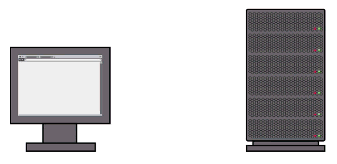

# AJAX

[Что такое AJAX](#what-is-ajax)

## Что такое AJAX

**AJAX** (*сокр.* Asynchronous JavaScript And XML) - это подход разработки на JavaScript, когда обращение к серверу происходит без перезагрузки странице.

После того как  страница открылась в браузере пользователя - мы можем обращатся к серверу, передавать данные и обновлять части страницы без перезагрузки всей страницы.

Благодаря AJAX сайты могут себя вести как настольные приложения и становятся возможными такие вещи как автозаполнение в поиске и загрузка данных для карты на лету.

Прежде чем разбирать AJAX, давайте поговорим о том как наш браузер получает информацию для отображения страницы.

* Когда браузер запрошивает страницу на сайте, ваша машина выступает в роли клиента, а веб-сайт находится на машине, которая предоставляет информацию - мы называем это сервером.
* Когда вы заходите на страницу, клиент делает запрос на сервер и сервер даёт ему эту страницу.
* И когда вы просматриваете эту страницу вам может потребоватся дополнительная информация с сервера. К примеру на сайте есть эскизы фотоальбома и этих эскизов больше чем вы можете здесь увидеть. Без AJAX если вы хотете увидеть больше эскизов, вам нужно снова сделать запрос на сервер и он пришлёт вам полностью новую страницу с дополнительными эскизами, а это значит что сервер вам посылает очень много информации, которая вам снова и снова не нужна
* С использованием AJAX серверу не нужно посылать вам всю страницу - он может послать вам только кусочки, которые вам нужны, в данном случае эскизы.

Как же всё это работает?

AJAX - это не одна технология, это група технологий, которые для этого работают вместе. Технически AJAX означает асинхронный JavaScript и XML.

* **A**, тоесть Асинхронный означает что клиент может запросить любую часть информации из сервера в любое время. Ему не нужно ждать перезагрузку страницы, новый запрос может быть вызван каким либо событием, как клик по кнопке, наведение на изображение.
* **J** означает JavaScript - он и делает всю работу. Он управляет событиями, которые вызывают новые запросы, делает эти запросы на сервер и занимается обновлением только той части документа, которую нужно изменить.
* JavaScript общается с сервером с помощью наборов методов программирования, которые называются API и использует так называемые запросы XHR или объект `XMLHttpRequest` вот что значит **X**. XHR позволяет браузеру посылать и получать данные с сервера.

Это может немного запутать потому что многие люди думают, что XML это язык для описания данных, но он почти как HTML. И иногда люди предполагают что **X** в AJAX обозначает то что данные объязательно должны быть в XML формате, но данные которые посылаются с сервера и обратно могут быть в любом формате, обычно это либо текстовый файл, либо HTML файл, либо файл в формате JSON.

Короче, AJAX - это просто термин для технологии, которая позволяет создавать страницы без необходимости их перезагрузки, но большинство работы в AJAX делает JavaScript, который использует API XHR чтобы установить связь между клиентом и сервером.