# Создание CMP или собственной страницы в админ-панели MODX

* [Первые шаги](#first-setup-steps)
    * [Пространства имён](#namespace)
    * [Экшены и меню](#action-menu)
    * [Словари](#lexicons)
* [Настройка контроллеров с MODExt](#controllers-modext)
    * [Базовый контроллер](#base-controller)
* [Наша CMP страница](#our-cmp)
    * [Файл JS секции](#section-js-file)
    * [Файл JS панели](#panel-js-file)
* [Сетка Doodles](#doodles-grid)
    * [Подключение через коннекторы](#hooking-connectors)
    * [Добавление поиска](#adding-search)
    * [Добавление окна обновления](#adding-update-window)
    * [Добавления опции удалить в контекстном меню](#adding-remove)
    * [Добавление формы создания](#create-form)
    * [Добавление инлайнового редактирования сетки](#adding-inline-editing)
* [Итоги](#summary)

В данной части мы рассмотрим создание пользовательской страницы админ панели (Custom Manager Pages или CMP) для нашего дополнения Doodles, которое мы уже создали в предыдущем уроке. В этом уроке мы рассмотрим создание контроллеров/коннекторов/процессоров, пространства имён, экшенов (действий), элементов меню и работу с Ext JS для создания пользовательского интерфейса.

<div id="first-setup-steps"></div>

## Первые шаги установки

У нас есть наш сниппет и базовая структура каталогов. Теперь нам нужно сделать несколько вещей перед началом разработки нашей пользовательской страницы. Первая - это пространства имён (Namespace).

<div id="namespace"></div>

### Пространства имён

[Пространство имён](https://docs.modx.com/revolution/2.x/developing-in-modx/advanced-development/namespaces) загружают основной путь для вашей CMP и сообщают MODX где брать файлы для неё и для файлов словарей (Lexicon или i18n). Они позволяют вам разрабатывать и запускать ваши дополнения без необходимости изменения файлов ядра MODX, а также возможность разработки MODX с использование систем контроля версий.

Для создания нового простраства имён переходим в меню на *Система / Пространства имён* и кликаем по кнопке **Создать новый**.

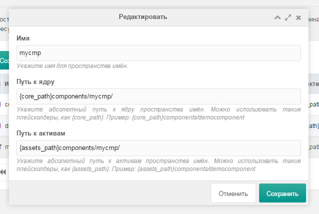

* **Имя** - `doodles`
* **Путь к ядру** - `{base_path}doodles/core/components/doodles/`
* **Путь к активам** - `{site_url}doodles/assets/components/doodles/`

Это позволяет нам установить ключ пространства имён 'doodles', с помощью которого мы можем ссылаться на наше пространство имён. Во-вторых мы указываем путь к ядру нашего каталога *doodles*, в котором мы ведём разработку. Он указывает MODX подгружать файлы контроллера, которые загружают CMP из необходимого нам каталога. И когда кто-то ещё в дальнейшем будет устанавливать данный компонент, путь пространства имён будет иметь следующий вид:

```
{core_path}components/doodles/
```

Потому что именно туда мы будем устанавливать файлы с помощью транспортного пакета. В то же время установка абсолютного пути (на данный момент) позволит нам разрабатывать дополнение за пределами корневого каталога (*core/*) MODX.

Подобным образом мы устанавливаем пути к активам (Assets Path), позволяющие MODX находить наши файлы активов.

Теперь вы можете перейти в системные настройки и отредактировать две настройки, которые вы добавили `doodles.core_path`

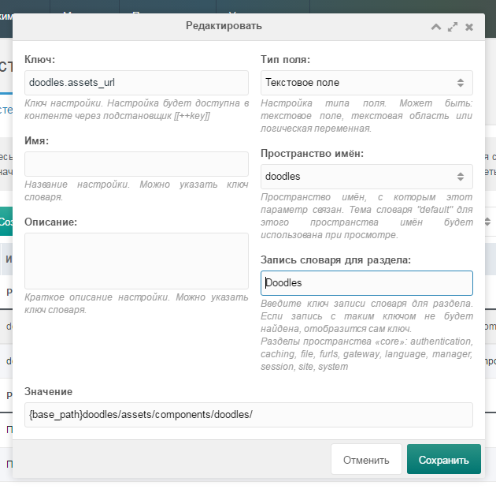

И `doodles.assets_url` и установить их в пространство имён `doodles`, а также область словарей (Area Lexicon Entry) в `Doodles`.

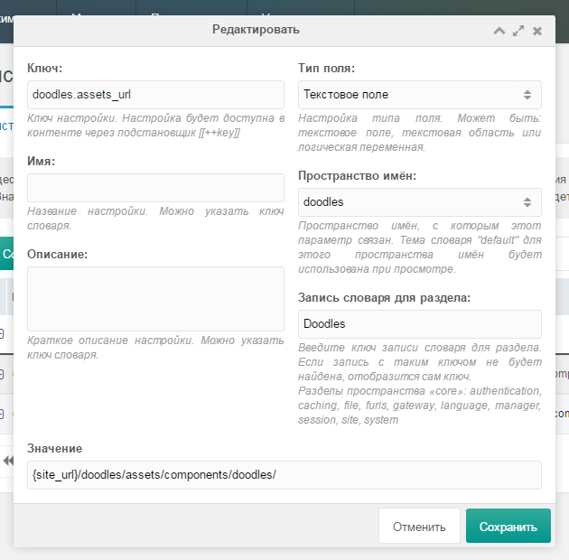

<div id="action-menu"></div>

### Экшены и меню

Теперь нам нужно создать новый пункт меню, который будет запускать определённый экшн (Action). Экшн или действие в MODX - это абстрактное представление страницы админ-панели. Каждый пункт меню админ-панели записывается в таблицу `modx_menus`.

На текущий момент CMP могут быть загруженны с указанием пространства имён и имени нашего файла PHP контроллера (теперь не нужно искать номер экшена в БД, как это было в более ранних версиях MODX).

Так что, если мы назовем наш контроллер *index.class.php*, то наш экшн можно будет вызывать просто указав `index`, а если *home.class.php*, тогда `home`.

В нашем случае, мы уже создали пространство имен с названием `doodles`, и позже мы создим наш файл контроллера с именем `index.class.php`. После чего наш CMP можно будет вызывать с помощью такого URL: [http://sitename.loc/manager/?a=index&namespace=doodles](http://sitename.loc/manager/?a=index&namespace=doodles)

До версии MODX 2.3, если бы мы указали нашей CMP номер экшена `2`, то она бы вызывалась с помощью такого URL: [http://sitename.loc/manager/?a=2](http://sitename.loc/manager/?a=2)

Идём дальше и теперь создадим новый пункт меню, который будет устанавливать URL к файлу контроллера для загрузки CMP.

Более подробно об этом [читайте здесь](/cmp.html)

Нам следует перейти в раздел основного меню *Система / Меню* кликнуть по кнопке *Добавить пункт* и заполнить несколько полей.

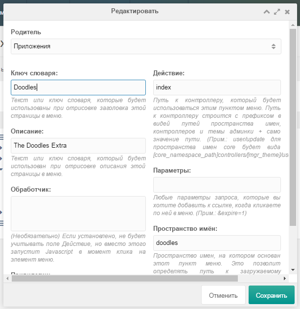

* **Родитель**: `Приложения`
* **Ключ словаря**: `Doodles`
* **Описание**: `The Doodles Extra`
* **Действие**: `index`
* **Пространство имён**: `doodles`

Давайте разберёмся что значит каждое из полей.

* **Родитель**: родительский пункт меню. Нам нужно, чтобы наше дополнение было внутри раздела **Приложения**.
* **Ключ словаря**: это ключ словаря (lexicon key) для нашего пункта меню. В MODX предусмотрена возможность просмотра админ-панели на нескольких языках и система предоставляет нам вариант загрузки строк словарей для перевода. На данный момент мы просто напрямую указываем имя, но вы можете изменить строку словаря позже.
* **Описание**: можно указать описание напрямую, либо указать ключ словаря для перевода.
* **Обработчик**: позволяет запускать JavaScript вместо загрузки страницы при запуске пункта меню. Это полезно для пунктов меню, которые в действительности не загружают страницу, но при этом выполняют какие-то полезные действия (как например команда **Очистить кэш**).
* **Права доступа** - здесь можно указать права доступа, которые проверяют, имеет ли пользователь доступ к данном разделу или нет. И если пользователь не имеет этого разрешения, тогда этот пункт меню не будет загружаться. Мы не хотим ограничивать доступ к нашей CMP, поэтому мы просто оставим это поле пустым.
* **Действие** - указывает экшн, который следует загрузить, когда мы кликаем по данному пункту. Это имя нашего файла контроллера, относительно пространства имён. MODX будет искать файл контроллера в директории *doodles/core/components/doodles/controllers/*. Укажем `index` - но на самом деле файл контроллера будет называтся *index.class.php*.
* **Пространство имён**: мы будем использовать `doodles`, которое мы только что создали.
* **Параметры**: позволяет прикрепить GET параметры, которые будут передаватся в URL по нажатию на пункт меню. Нам это не нужно, так что просто оставляем пустым.
* **Значок** - позволяет добавить иконку для пункта меню.

Для того чтобы проверить работоспособность и корректность путей, можем уже сейчас создать тестовый контроллер, который просто будет загружать шаблон *home.tpl* и устанавливать заголовок страницы в разделе `head`:

*doodles/core/components/doodles/controllers/index.class.php*

```
<?php

class DoodlesIndexManagerController extends modExtraManagerController {

    public function process(array $scriptProperties = array()) {}

    public function getPageTitle() {
        return 'My Test CMP';
    }
    public function getTemplateFile() {
        return 'home.tpl';
    }
}
```

Теперь создадим сам шаблон:

*doodles/core/components/doodles/templates/home.tpl*

```
<div class="container">
    <h2>Doodles Home page</h2>
</div>
```

После сохранения мы уже должны увидеть новый пункт меню в разделе **Приложения** и при переходе у нас будет отображатся заголовок `h2` внутри контейнера с классом `container` и выводится заголовок в разделе `head`.

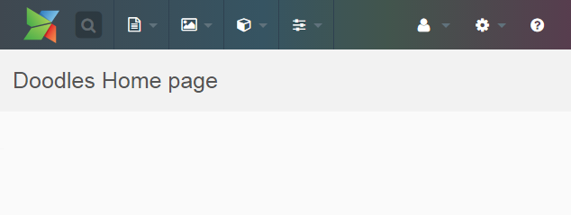

<div id="lexicons"></div>

### Словари

[Словари](https://docs.modx.com/revolution/2.x/developing-in-modx/advanced-development/internationalization) (Lexicon) MODX Revolution позволяет вам создавать переводы для ваших дополнений на любой язык. Каждая строка имеет собственный ключ, например, `doodles.desc`. Обычно ключём для словаря дополнения служит префикс названия пространства имён с точкой. Это предотвращает путаницу с другими дополнениями.

Строки словарей объединены в файлы называемые **Темами Словарей** (Lexicon Topics). Это значит, что ваши строки могут быть изолированы в одной специфической области (похоже на то как это делается в каталоге *core/lexicon/*) и это делается для того, чтобы вы не загружали все строки для вашего дополнения, в то время когда нужно загрузить всего несколько строк.

Если вы хотите использовать ваши словари в сниппете, вы можете использовать `$modx->lexicon->load('doodles:default')`. Это позволит загрузить тему по умолчанию (`default`) из пространства имен `doodles`. Для CMP следует поступать по-другому - вы загружаете тему словаря в класс контроллера с помощью метода `getLanguageTopics()`. Этот метод возвращает массив, что указывает на определённые темы словаря, которые следует загрузить.

Словари в файловой системе структурированы следующим образом:

```
{namespace_path}/lexicon/{language}/{topic}.inc.php
```

Давайте создадим файл темы словаря и вставим туда следующий код:

*doodles/core/components/doodles/lexicon/en/default.inc.php*

```
<?php

$_lang['doodle'] = 'Doodle';
$_lang['doodles'] = 'Doodles';
$_lang['doodles.desc'] = 'Manage your doodles here.';
$_lang['doodles.description'] = 'Description';
$_lang['doodles.doodle_err_ae'] = 'A doodle with that name already exists.';
$_lang['doodles.doodle_err_nf'] = 'Doodle not found.';
$_lang['doodles.doodle_err_ns'] = 'Doodle not specified.';
$_lang['doodles.doodle_err_ns_name'] = 'Please specify a name for the doodle.';
$_lang['doodles.doodle_err_remove'] = 'An error occurred while trying to remove the doodle.';
$_lang['doodles.doodle_err_save'] = 'An error occurred while trying to save the doodle.';
$_lang['doodles.doodle_create'] = 'Create New Doodle';
$_lang['doodles.doodle_remove'] = 'Remove Doodle';
$_lang['doodles.doodle_remove_confirm'] = 'Are you sure you want to remove this doodle?';
$_lang['doodles.doodle_update'] = 'Update Doodle';
$_lang['doodles.downloads'] = 'Downloads';
$_lang['doodles.location'] = 'Location';
$_lang['doodles.management'] = 'Doodles Management';
$_lang['doodles.management_desc'] = 'Manage your doodles here. You can edit them by either double-clicking on the grid or right-clicking on the respective row.';
$_lang['doodles.name'] = 'Name';
$_lang['doodles.search...'] = 'Search...';
$_lang['doodles.top_downloaded'] = 'Top Downloaded Doodles';
```

Всё что мы делаем - это заполняем PHP массив `$_lang`, остальное сделает MODX.

<div id="controllers-modext"></div>

## Настройка контроллеров с MODExt

CMP в MODX генерируются с помощью ExtJS - JavaScript фреймворка от Sencha, который позволяет выполнять быструю разработку пользовательских интерфейсов. MODX добавляет функциональность к некоторым инструментам ExtJS и называет их MODExt. Мы разберёмся в том как использовать Ext JS для создания сетки которая будет способна выполнять CRUD операции.

В начале нам нужно настроить базовый контроллер.

<div id="base-controller"></div>

### Базовый контроллер

Давайте создадим наш базовый контроллер и вставим туда следующий код:

*/www/doodles/core/components/doodles/controllers/index.class.php*

```
<?php

/** 
 * @var Doodles $doodles
 */

require_once dirname(dirname(__FILE__)) . '/model/doodles/doodles.class.php';
class DoodlesIndexManagerController extends modExtraManagerController {
    public $doodles;
    public function initialize() {
        $this->doodles = new Doodles($this->modx);
        $this->addCss($this->doodles->config['cssUrl'].'mgr.css');
        $this->addJavascript($this->doodles->config['jsUrl'].'mgr/doodles.js');
        $this->addHtml('<script type="text/javascript">
                                        Ext.onReady(function() {
                                                Doodles.config = '.$this->modx->toJSON($this->doodles->config).';
                                        });
                                        </script>');
        return parent::initialize();
    }
    public function getLanguageTopics() {
        return array('doodles:default');
    }
    public function checkPermissions() { return true;}
    public function process(array $scriptProperties = array()) {}
    public function getPageTitle() { return $this->modx->lexicon('doodles'); }
    public function loadCustomCssJs() {
        //$this->addJavascript($this->doodles->config['jsUrl'].'mgr/widgets/doodles.grid.js');
        $this->addJavascript($this->doodles->config['jsUrl'].'mgr/widgets/home.panel.js');
        $this->addLastJavascript($this->doodles->config['jsUrl'].'mgr/sections/index.js');
    }
    public function getTemplateFile() {
        return $this->doodles->config['templatesPath'].'home.tpl';
    }
}
```

Хотя кода стало больше, страница CMP у нас совершенно не изменилась, при этом контроллер у нас стал намного функциональней.

Здесь мы создаем класс контроллера для нашего дополнения `DoodlesIndexManagerController`, который расширяет `modExtraManagerController` - это специальный класс для разработки дополнений. MODX, начиная с версии 2.3, выполняет маршрутизацию запросов с помощью классов контроллеров.

* В методе `initialize()`, который вызывается при загрузке контроллера, мы хотим убедиться, что всегда добавляем необходимые CSS/JS, а также предоставляем нашему контроллере доступ к объекту класса `Doodles`.
* Во-вторых, мы определяем метод `getLanguageTopics()`, который сообщает MODX, что следует загрузить необходимый файл словаря для админ-панели.
* После этого мы определяем метод `checkPermissions()`, который проверяет права доступа и если не вернется `true`, тогда запретить доступ к этой странице контроллера.
* Определяем метод `process()`, который необходимо определять для каждого контроллера админ-панели. Пока что мы не будем его использовать, поэтому просто оставим его пустым.
* Далее мы устанавливаем заголовок страницы через метод `getPageTitle()` - сюда мы передаём ключ со словаря `doodles`.
* После этого мы определяем метод `loadCustomCssJs()`, который позволяет регистрировать необходимые CSS/JS для данной страницы. Мы загружаем файл виджетов (widget) *doodles/assets/components/doodles/js/mgr/widgets/home.panel.js* и файл секции (section) *doodles/assets/components/doodles/js/mgr/sections/index.js*. Эти термины (виджеты и секции) являются произвольными, но мы их также будем использовать, так как это принято в MODExt.
    * **Виджеты** (widgets) - это как правило какие-то объекты сетки (grid objects), или дерева (tree) или специализированные панели. Если помещать виджеты в отдельные файлы, то это позволяет их использовать на разных страницах без необходимости дублирования кода.
    * **Секция** (section) - это часть JS, которая на самом деле загружает виджеты на страницу. Подключение виджета не загружает и не рендерит его - это делает секция.

В начале мы загружаем *doodles.grid.js* - это виджет, который отображает сетку `Doodles`. Далее мы загружаем *home.panel.js*, который отрисует основную панель загружаемой (домашней) страницы, в которой будет находится сетка. После чего, мы загружаем файл секции *index.js*, который будет рендерить интерфейс.

Пока что мы оставим сетку закомментированной, но мы ещё к ней вернемся.

В самом конце, с помощью метода `getTemplateFile()`, мы указываем MODX, где необходимо искать файл шаблона для данного контроллера. Это Smarty шаблон, который MODX будет использовать во время рендеринга контроллера. Давайте откроем файл шаблона и заменим его содержимое следующим:

*doodles/core/components/doodles/templates/home.tpl*

```
<div id="doodles-panel-home-div"></div>
```

Обратите внимание на то, что в функции `initialize()` нашего контроллера, мы также загружаем общий JS файл, *mgr/doodles.js* в из нашего каталога JS. После того как Ext JS будет загружен (`Ext.onReady`), выполняется анонимная функция, которая загружает `$doodles->config` в свойство `Doodles.config`.

Добавьте в файл *doodles.js* следующий код:

*doodles/assets/components/doodles/js/mgr/doodles.js*

```
var Doodles = function(config) {
    config = config || {};
    Doodles.superclass.constructor.call(this,config);
};
Ext.extend(Doodles,Ext.Component,{
    page:{},window:{},grid:{},tree:{},panel:{},combo:{},config: {}
});
Ext.reg('doodles',Doodles);
Doodles = new Doodles();
```

Здесь мы загружаем объект `Doodles`, который расширяет класс `Ext.Component`, что в свою очередь создаёт для нас JavaScript пространство имен в `Doodles`.

<div id="our-cmp"></div>

## Наша CMP страница

<div id="section-js-file"></div>

### Файл JS секции

В начале создадим файл *index.js*:

*doodles/assets/components/doodles/js/mgr/sections/index.js*

```
Ext.onReady(function() {
    MODx.load({xtype: 'doodles-page-home'});
});
Doodles.page.Home = function(config) {
    config = config || {};
    Ext.applyIf(config,{
        components: [{
            xtype: 'doodles-panel-home'
            ,renderTo: 'doodles-panel-home-div'
        }]
    });
    Doodles.page.Home.superclass.constructor.call(this,config);
};
Ext.extend(Doodles.page.Home,MODx.Component);
Ext.reg('doodles-page-home',Doodles.page.Home);
```

В начале мы указываем Ext JS, что когда страница загружена следует загрузить компонент (или виджет/объект/панель) с `xtype: 'doodles-panel-home'`. Ext JS позволяет определить компонент с `xtype`, который как уникальный идентификатор для панели, дерева и т. д. Думайте о нем, как о идентификаторе класса. `MODx.load` просто создает экземпляр этого объекта.

Ниже, мы фактически определяем объект `doodles-page-home`, и делаем его расширением `MODx.Component`. `MODx.Component` по сути является абстрактным классом, который отображает страницы в панели управления MODX. Он предоставляет несколько вспомогательных методов, которые делают быструю генерацию страниц в MODX плавной. Все, что нам нужно передать в него - это компоненты которые мы хотим загрузить, на данным момент это компонент `doodles-panel-home` (который мы еще не создали, но сделаем это в файле *home.panel.js*). Кроме этого, мы хотим чтобы это отображалось внутри блока с ID `doodles-panel-home-div`, который мы создали в шаблоне *home.tpl*

Наконец, мы регистрируем эту страницу в xtype `doodles-page-home`, на который мы ссылаемся во время вызова `MODx.load`.

<div id="panel-js-file"></div>

### Файл JS панели

У нас уже есть наша страница, но теперь мы хотим, загрузить в неё панель. Давайте создадим файл *home.panel.js* и добавим следующий код:

*doodles/assets/components/doodles/js/mgr/widgets/home.panel.js*

```
Doodles.panel.Home = function(config) {
    config = config || {};
    Ext.apply(config,{
        border: false
        ,baseCls: 'modx-formpanel'
        ,cls: 'container'
        ,items: [{
            html: '<h2>'+_('doodles.management')+'</h2>'
            ,border: false
            ,cls: 'modx-page-header'
        },{
            xtype: 'modx-tabs'
            ,defaults: { border: false ,autoHeight: true }
            ,border: true
            ,items: [{
                title: _('doodles')
                ,defaults: { autoHeight: true }
                ,items: [{
                    html: '<p>'+_('doodles.management_desc')+'</p>'
                    ,border: false
                    ,bodyCssClass: 'panel-desc'
                }/*,{
                 xtype: 'doodles-grid-doodles'
                 ,cls: 'main-wrapper'
                 ,preventRender: true
                 }*/]
            }]
            // only to redo the grid layout after the content is rendered
            // to fix overflow components' panels, especially when scroll bar is shown up
            ,listeners: {
                'afterrender': function(tabPanel) {
                    tabPanel.doLayout();
                }
            }
        }]
    });
    Doodles.panel.Home.superclass.constructor.call(this,config);
};
Ext.extend(Doodles.panel.Home,MODx.Panel);
Ext.reg('doodles-panel-home',Doodles.panel.Home);
```

Обратите внимание, в самом конце файла, как мы регистрировали эту панель для `doodles-panel-home`, на которую мы ссылались в нашей секции. Также обратите внимание, что эта панель расширяет объект `MODx.Panel`, который, в свою очередь, расширяет `Ext.Panel`. Почему же просто не расширить `Ext.Panel`? `MODx.Panel` делает всё то же самое, но при этом добавляет определённые CSS классы панели, чтобы придать необходимый внешний вид.

Мы указываем для данной панели `baseCls: 'modx-formpanel'`, что позволит для верхней части страницы указать прозрачный фон. Также нам нужен класс `container`, который задаёт необходимое растояние между элементами. После чего нам нужно убедится, что у него нет рамки (`border: false`).

Далее мы определяем элементы панели. В начале, мы добавим заголовок:

```
{
    html: '<h2>'+_('doodles.management')+'</h2>'
    ,border: false
    ,cls: 'modx-page-header'
}
```

Здесь мы просто добавляем немного HTML в верхную часть панели с классом `modx-page-header`, и внутрь вставляем заголовок `h2`. Обратите внимание на метод `_()`, с помощью которого реализуется поддержка мультиязычности в MODX внутри JS панели управления. Таким образом мы указываем  MODX, что следует перевести ключ `doodles.management`, который мы определили в файле словаря.

Далее, мы добавим панель табов (вкладок):

```
,{
    xtype: 'modx-tabs'
    ,defaults: { border: false ,autoHeight: true }
    ,border: true
    ,items: /* ... */
}
```

Обратите внимание, что мы загружаем нашу панель с табами с `xtype: 'modx-tabs'`. Это загружает панель табов, которая имеет, специфичные для MODX, параметры конфигурации. Затем мы придаём панели немного отступов, рамку, и проверяем чтобы по умолчанию для этих вкладок не была установлена рамка и указана высота. После этого, мы добавляем себе эту вкладку:

```
{
     title: _('doodles')
     ,defaults: { autoHeight: true }
     ,items: [{
            html: '<p>'+_('doodles.management_desc')+'</p><br />'
            ,border: false
            ,bodyCssClass: 'panel-desc'
     }]
}
```

Это позволит вывести заголовок для нашей первой вкладки. После чего мы добавим небольшое описание внутрь вкладки (`Ext.Panel`) используя ключ словаря `doodles.management_desc`.

Теперь у вас должна открыватся CMP, где будет отображатся заголовок и одна вкладка с описанием внутри.

Если вы захотите добавить поддержку собственного (например русского) языка, вам нужно просто скопировать папку *doodles/core/components/doodles/lexicon/en/* и переименовать согласно кода IANA для вашего языка (например для русского будет *ru/*).

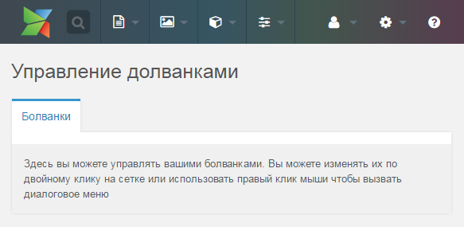

<div id="doodles-grid"></div>

## Сетка Doodles

В начале нужно раскоментировать данную строку в контроллере *index.class.php*:

*doodles/core/components/doodles/controllers/index.class.php*

```
$this->addJavascript($this->doodles->config['jsUrl'].'mgr/widgets/doodles.grid.js');
```

Здесь мы говорим MODX, что следует загрузить файл виджета сетки, который мы сейчас создадим:

*doodles/assets/components/doodles/js/mgr/widgets/doodles.grid.js*

```
Doodles.grid.Doodles = function(config) {
    config = config || {};
    Ext.applyIf(config,{
        id: 'doodles-grid-doodles'
        ,url: Doodles.config.connectorUrl
        ,baseParams: { action: 'mgr/doodle/getList' }
        ,fields: ['id','name','description','menu']
        ,paging: true
        ,remoteSort: true
        ,anchor: '97%'
        ,autoExpandColumn: 'name'
        ,columns: [{
            header: _('id')
            ,dataIndex: 'id'
            ,sortable: true
            ,width: 60
        },{
            header: _('doodles.name')
            ,dataIndex: 'name'
            ,sortable: true
            ,width: 100
            ,editor: { xtype: 'textfield' }
        },{
            header: _('doodles.description')
            ,dataIndex: 'description'
            ,sortable: false
            ,width: 350
            ,editor: { xtype: 'textfield' }
        }]
    });
    Doodles.grid.Doodles.superclass.constructor.call(this,config)
};
Ext.extend(Doodles.grid.Doodles,MODx.grid.Grid);
Ext.reg('doodles-grid-doodles',Doodles.grid.Doodles);
```

Здесь имеется много чего, но давайте сначала разберёмся с параметрами конфигурации, которые мы устанавливаем.

* `id` - указываем ID `doodles-grid-doodles`.
* `url` - указываем файл коннектора `Doodles.config.connectorUrl` (мы вернёмся к коннекторам через несколько секунд).
* `baseParams` - устанавливаем основые параметры для отправки, когда будем получать записи для сетки через `REQUEST` с ключом `action` и значением `mgr/doodle/getList`. Позже мы об этом ещё поговорим.
* `fields` - устанавливаем поля, которые мы будет получать от AJAX запроса для заполнения сетки. В основном это поля `Doodle`.
* `paging` - нам необходима постраничная навигация для сетки, поэтому чтобы MODExt все это обработал нам нужно установить `paging: true`.
* `remoteSort` - мы устанавливаем это в `true`, и Ext JS позволит нам сделать сортируемые колонки сетки.
* `anchor` - мы хотим растянуть данную сетку на всю ширину панели, поэтому мы установим это значение `97%` (`3%` для отступа).
* `autoExpandColumn` - мы хотим растягивать колонку `name` динамически, чтобы сделать её самой большой колонкой в сетке.

Затем мы определяем некоторые столбцы для нашей сетки. Мы также делаем поля `name` и `description` редактируемыми путем подключения редактора к каждой колонке. Подробнее об этом позже. Обратите внимание, что параметр `dataIndex` совпадает с именем поля `Doodles`, который мы хотим отобразить.

Наконец, давайте добавим сетку к нашей панели. Удалим теги комментариев в файле *home.panel.js* в строках 22 и 26:

*doodles/assets/components/doodles/js/mgr/widgets/home.panel.js*

```
[{
     html: '<p>'+_('doodles.management_desc')+'</p>'
     ,border: false
},{
     xtype: 'doodles-grid-doodles'
     ,cls: 'main-wrapper'
     ,preventRender: true
}]
```

Это загружает нашу сетку прямо под сообщением, которое мы разместили ранее в нашей панели, с небольшим отступом благодаря CSS классу `main-wrapper`. Атрибут `preventRender` говорит Ext JS не выполнять рендер сетки, пока не будут загруженны другие панели.

Если вы обновите сейчас страницу, то сетка уже отобразиться, но пока что не будет загружать какие-либо данные, потому что мы ещё не создали наш коннектор и сетке неоткуда извлекать свои данные. Давайте сделаем это.

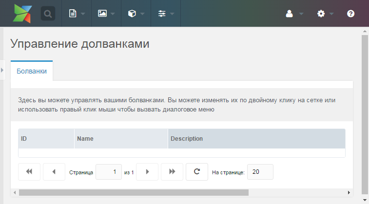

<div id="hooking-connectors"></div>

### Подключение через коннекторы

Коннектор или соединитель (connector) - это файл, который подключается к слою модели MODX или процессорам. Процессоры - это PHP файлы, которые запускают запросы к БД и другие вещи, которые могут изменять модель и/или базу данных.

Другими словами, процессоры - это то место, где вы будете модифицировать вашу базу данных. Коннекторы - это шлюзы к этим процессорам. Они ограничивают доступ, проверяют права доступа и направляют запросы к соответствующему процессору. Они также ограничивают точки доступа к вашей модели для безопасности вашего приложения.

Вернёмся к нашему дополнению. Нашей Ext JS сетке нужно загружать данные для её строк через AJAX с помощью нашего коннектора. Но нам нужно вначале создать этот коннектор.

*doodles/assets/components/doodles/connector.php*

```
<?php

require_once dirname(dirname(dirname(dirname(__FILE__)))).'/config.core.php';
require_once MODX_CORE_PATH.'config/'.MODX_CONFIG_KEY.'.inc.php';
require_once MODX_CONNECTORS_PATH.'index.php';
$corePath = $modx->getOption('doodles.core_path',null,$modx->getOption('core_path').'components/doodles/');
require_once $corePath.'model/doodles/doodles.class.php';
$modx->doodles = new Doodles($modx);
$modx->lexicon->load('doodles:default');

/* handle request */
$path = $modx->getOption('processorsPath',$modx->doodles->config,$corePath.'processors/');
$modx->request->handleRequest(array(
    'processors_path' => $path,
    'location' => '',
));
```

Вначале мы загружаем файл *config.core.php*. Далее добавляем его в наше рабочее окружение (в стандартной MODX установке это уже имеется).

Создадим файл конфигурации и вставим туда следующий код:

*doodles/config.core.php*

```
<?php

define('MODX_CORE_PATH', 'D:/xampp/htdocs/modxtest.loc/core/');
define('MODX_CONFIG_KEY', 'config');
```

Очевидно, что вам нужно поменять эти значения на пути к вашей установленной MODX. Если вы используете систему контроля версий, то вероятней всего этот файл нужно игнорировать и не отслеживать.

В нашем коннекторе мы загрузим конфигурационный файл и файл *connectors/index.php*.

Далее мы загружаем класс `Doodles` (с нашими системными настройками), который добавит нашу пользовательскую xPDO модель `Doodles` в MODX и затем загрузит нашу дефолтную тему словарей. И наконец, мы обработаем запрос, используя наши пути к кастомным процессорам, которые мы определили в нашем  классе `Doodles` и скажем MODX загрузить эти процессоры.

Этот файл сам по себе ничего не делает и если мы обратимся к нему напрямую, то получим примерно следующее следующее:

```
{"success":false,"message":"Access denied.","total":0,"data":[],"object":[]}
```

На это есть несколько причин. Во-первых это то, что коннекторы заблокированы и не дадут кому-угодно доступ к себе без сессии панели управления MODX. Во-вторых, все запросы к коннекторам должны передавать уникальный ключ авторизации для вашего сайта, который предотвращает CRSF атаки. Он очень просто может передаватся в заголовках HTTP, в качестве `modAuth` или в переменной `REQUEST`, в качестве `HTTP_MODAUTH`. Это значение будет находится в `$modx->siteId` - оно задаётся во время новой установки и загружается, когда будет загружен MODX.

Никогда не копируйте и делитесь с кем-либо вашим ключом `$modx->siteId` или `HTTP_MODAUTH`. Таким образом, это обезопасит ваш сайт. MODX уже обработал это в MODExt - все HTTP запросы сделанные Ext JS в MODX передают эту переменную через свои HTTP заголовки.

Вызов файла коннектора напрямую не сработает ещё и потому, что мы не указали роутинг пути (параметр `baseParams` в файле *doodles.grid.js*). Мы устанавливали параметр `action: 'mgr/doodle/getList'` - это и есть наш роутинг пути. Он сообщает коннектору какой нужно загрузить файл, чтобы передавать данные для нашей сетки:

*doodles/core/components/doodles/processors/mgr/doodle/getlist.class.php*

```
<?php

class DoodleGetListProcessor extends modObjectGetListProcessor {
    public $classKey = 'Doodle';
    public $languageTopics = array('doodles:default');
    public $defaultSortField = 'name';
    public $defaultSortDirection = 'ASC';
    public $objectType = 'doodles.doodle';
}
return 'DoodleGetListProcessor';
```

MODX (начиная с версии 2.2) имеет новые классы процессоров, которые включают вспомагательный класс `modObjectGetListProcessor`, который мы здесь расширяем. Этот класс автоматически выполняет всю базовую логику для обработки стандартных CRUD операций процессора. Всё что нам нужно - это определить некоторые переменные класса, например `$classKey`, `$objectType` и т. д.:

* `$classKey` - сообщает процессору какой нужно захватить класс MODX. Нам нужно захватить наши объекты `Doodle`.
* `$languageTopics` - массив загружаемых языковых тем для данного процессора.
* `$defaultSortField` - поле сортировки по-умолчанию при захвате данных.
* `$defaultSortDirection` - направление сортировки по-умолчанию при захвате данных.
* `$objectType` - часто используется для определения того, какую ошибку строк словаря необходимо загружать при захвате данных. Так как в нашем файле словаря все строки имеют приблизительной такой вид `$_lang['doodles.doodle_blahblah']`, поэтому мы определяем здесь префикс `doodles.doodle`. Тогда MODX будет добавлять данный префикс к стандартным сообщениям об ошибке.

Этот класс поддержки обрабатывает всё остальное, поэтому нам не нужно волноватся по этому поводу. Всё, что нам нужно сделать - это возвратить имя класса процессора, чтобы MODX знал где его искать.

Теперь давайте загрузим нашу сетку:

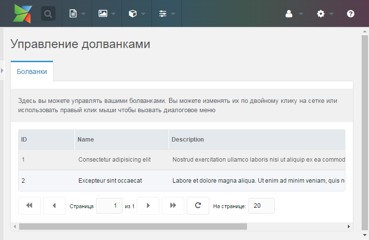

Теперь у нас есть работающая таблица, которая пока что просто выводит список данных из БД.

<div id="adding-search"></div>

### Добавление поиска

Добавим немного кода в панель сетки в *widgets/doodles.grid.js*, сразу после стобцов, определённых на 29 строке:

*doodles/assets/components/doodles/js/mgr/widgets/doodles.grid.js*

```
,tbar:[{
    xtype: 'textfield'
    ,id: 'doodles-search-filter'
    ,emptyText: _('doodles.search...')
    ,listeners: {
        'change': {fn:this.search,scope:this}
        ,'render': {fn: function(cmp) {
            new Ext.KeyMap(cmp.getEl(), {
                key: Ext.EventObject.ENTER
                ,fn: function() {
                    this.fireEvent('change',this);
                    this.blur();
                    return true;
                }
                ,scope: cmp
            });
        },scope:this}
    }
}]
```

Мы только что добавили текстовое поле в верхнюю часть нашей сетки, и указали для него свойство `emptyText`, тоесть текст, который будет отображатся, когда это текстовое поле будет не заполненным. Мы также задали для него ID `doodles-search-filter`, и указали что нам нужно запускать метод `this.search`, когда меняется значение данного поля. Кроме этого, код внутри слушаетеля `render` запускает событие `change`, после того как пользоваль введёт какой-то текст в строку поиска и нажмёт <kbd>Enter</kbd> на клавиатуре.

Теперь давайте определим метод `search`. Так как наша панель объектно-ориентированна, мы можем определить метод `this.search` внутри нашего объекта сетки `Doodles.grid.Doodles`. Найдите данный код на 52 строке:

*doodles/assets/components/doodles/js/mgr/widgets/doodles.grid.js*

```
Ext.extend(Doodles.grid.Doodles,MODx.grid.Grid);
```

И замените на этот:

*doodles/assets/components/doodles/js/mgr/widgets/doodles.grid.js*

```
Ext.extend(Doodles.grid.Doodles,MODx.grid.Grid,{
    search: function(tf,nv,ov) {
        var s = this.getStore();
        s.baseParams.query = tf.getValue();
        this.getBottomToolbar().changePage(1);
        this.refresh();
    }
});
```

Здесь мы расширяем класс `MODx.grid.Grid`, затем добавляем еще один метод, с именем `search`. В этом методе, мы получаем хранилище сетки (grid store), которое определяет, где хранятся данные и от куда эти данные поступают. Затем мы добавляем параметр `query` к нашим базовым параметрам, которые мы определили ранее в `baseParams`, изменяя текущую страницу сетки обратно до 1, и обновляя ее.

Это будет передавать `REQUEST` параметр `query` нашему процессору `getList` в файле *getlist.class.php*. Так как мы пока ничего не сделали, чтобы обработать это, давайте откроем данный файл и добавим дополнительный метод в наш класс после 7 строки:

*doodles/core/components/doodles/processors/mgr/doodle/getlist.class.php*

```
public function prepareQueryBeforeCount(xPDOQuery $c) {
    $query = $this->getProperty('query');
    if (!empty($query)) {
        $c->where(array(
            'name:LIKE' => '%'.$query.'%',
            'OR:description:LIKE' => '%'.$query.'%',
        ));
    }
    return $c;
}
```

Вспомагательный класс `modObjectGetListProcessor` позволяет расширять метод `prepareQueryBeforeCount()` для изменения объекта `xPDOQuery`, прежде чем он передается методу `getCount()`. Все, что нам нужно сделать, это вернуть наш измененный объект запроса. Нам нужно его расширить, чтобы добавить возможность поиска по нашей сетки с помощью параметра `query`. Обратите внимание, что мы можем получить этот параметр через метод `getProperty()`.

Теперь если вы загрузите сетку, то вы должны получить:

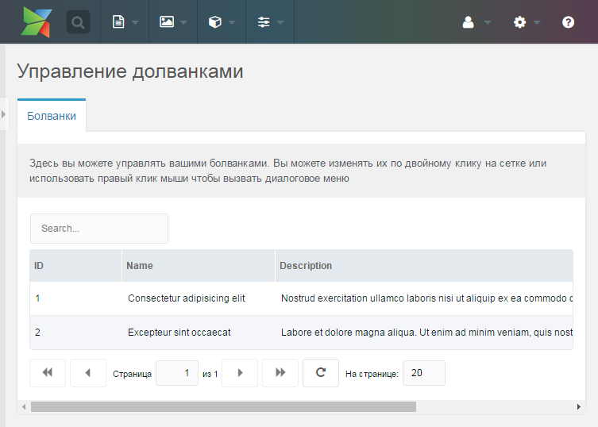

Если у вас не выводится строка поиска, возможно вам нужно просто почистить кэш браузера, чтобы обновилось содержимое файла *doodles.grid.js*.

Теперь у нас есть возможность использовать AJAX поиск для фильтрации данных из БД по полям `title` и `description`.

<div id="adding-update-window"></div>

### Добавление окна обновления

MODX сетка обычно имеет контекстное меню, но у нашей сетки такого меню пока ещё нет, потому что мы его не определили. Для этого добавим метод `getMenu()` к нашему определению `Doodles.grid.Grid` сразу же после поиска (метод, который мы только добавили, 48 строка):

*doodles/assets/components/doodles/js/mgr/widgets/doodles.grid.js*

```
,getMenu: function() {
    return [{
        text: _('doodles.doodle_update')
        ,handler: this.updateDoodle
    },'-',{
        text: _('doodles.doodle_remove')
        ,handler: this.removeDoodle
    }];
}
```

MODX ищет метод `getMenu()` на сетке, которая расширяет его и если находит, то запускает. Далее мы добавляем любые элементы меню, которые следует вернуть. Мы добавили 2 элемента меню - один запускается методом `this.updateDoodle`, а другой `this.removeDoodle`.

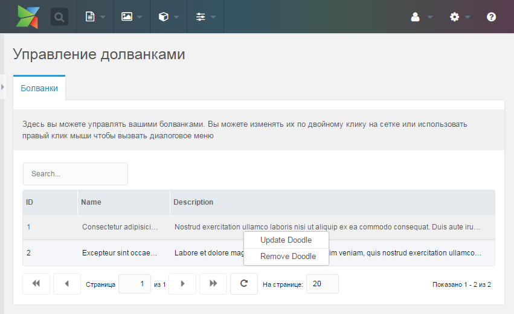

Мы вернёмся к методу `removeDoodle` чуть позже. А сейчас давайте добавим метод `updateDoodle` ниже вызова `getMenu` на 57 строке:

*doodles/assets/components/doodles/js/mgr/widgets/doodles.grid.js*

```
,updateDoodle: function(btn,e) {
    if (!this.updateDoodleWindow) {
        this.updateDoodleWindow = MODx.load({
            xtype: 'doodles-window-doodle-update'
            ,record: this.menu.record
            ,listeners: {
                'success': {fn:this.refresh,scope:this}
            }
        });
    }
    this.updateDoodleWindow.setValues(this.menu.record);
    this.updateDoodleWindow.show(e.target);
}
```

Этот код проверяет переменную класса с именем `updateDoodleWindow`. Если он её не находит, тогда он её создаст - таким образом, это препятствует Ext JS каждый раз создавать новое окно (это быстрее и лучше предотвращает ID конфликты DOM). Кроме этого, мы передаём несколько значений:

* `xtype` - это очевидно наш уникальный `xtype` для окна
* `record` -  объекты `MODx.Window` будут автоматически заполнять свои поля всем что передаётся в конфигурационном параметре `record`. Кроме этого, объекты `MODx.grid.Grid` всегда хранят значения текущего ряда в объекте `this.menu.record`, поэтому мы просто передадим его в наше окно.
* `listeners` - запускаются при различных событиях в окне. На данный момент мы хотим просто обновить сетку (через метод `this.refresh` для `MODx.grid.Grid`) каждый раз когда окно имеет успех, тоесть когда окно с формой успешно отправляет данные и возвращает в ответе `success`.

После создания окна, мы запускаем метод `show()`, который позволяет отобразить данное окно. `e.target` просто сообщает ему, что нужно анимировать открытие окна в точке, где находился курсор. Если у нас уже есть объект окна, перед этим мы вызываем на нём метод `setValues`, который устанавливает значения формы окна в передаваемые значения (подобно записи `param`). Это позволяет нам повторно использовать окна.

Давайте теперь определим окно, добавив данный код в самый конец нашего файла:

*doodles/assets/components/doodles/js/mgr/widgets/doodles.grid.js*

```
Doodles.window.UpdateDoodle = function(config) {
    config = config || {};
    Ext.applyIf(config,{
        title: _('doodles.doodle_update')
        ,url: Doodles.config.connectorUrl
        ,baseParams: {
            action: 'mgr/doodle/update'
        }
        ,fields: [{
            xtype: 'hidden'
            ,name: 'id'
        },{
            xtype: 'textfield'
            ,fieldLabel: _('doodles.name')
            ,name: 'name'
            ,anchor: '100%'
        },{
            xtype: 'textarea'
            ,fieldLabel: _('doodles.description')
            ,name: 'description'
            ,anchor: '100%'
        }]
    });
    Doodles.window.UpdateDoodle.superclass.constructor.call(this,config);
};
Ext.extend(Doodles.window.UpdateDoodle,MODx.Window);
Ext.reg('doodles-window-doodle-update',Doodles.window.UpdateDoodle);
```

Это подобно тому, что вы видели в сетках, но в этот раз у нас есть `fields` в качестве полей формы окна. У нас есть возможность редактировать несколько полей и так как это форма обновления данных, то нам нужно получать ID Doodle, который мы передаем в скрытом поле.

`MODx.Window` обворачивает `Ext.Window`, но предоставляет форму внутри, которая автоматически пытается подключится к указанному URL параметра `url:` с параметрами `baseParams:` и значениями полей. Кроме этого, в данном окне автоматически выводятся кнопки **Сохранить** и **Отменить**. Теперь если вы выберите команду **Update Doodle** из контекстного меню сетки, то вы получите следующее:

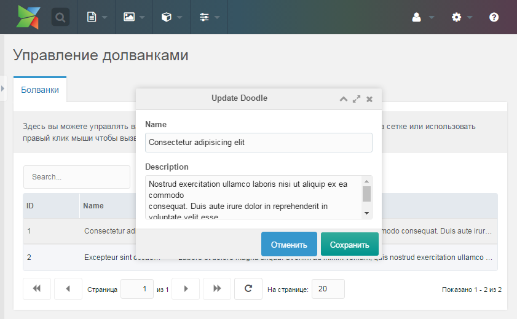

Возможно вы заметили что в параметре `baseParams`, мы теперь ищем процессор `mgr/doodle/update`. Давайте его создадим:

*doodles/core/components/doodles/processors/mgr/doodle/update.class.php*

```
<?php

class DoodleUpdateProcessor extends modObjectUpdateProcessor {
    public $classKey = 'Doodle';
    public $languageTopics = array('doodles:default');
    public $objectType = 'doodles.doodle';
}
return 'DoodleUpdateProcessor';
```

Здесь мы снова создаём класс процессора за счёт расширения существующего класса процессора, что предоставляет MODX и он автоматически проделает всю грязную работу по сохранению объекта. Всё, что нам нужно сделать - это определить несколько свойств (`classKey` и др.). Это позволит обработать сохранение и ответ автоматически.

Теперь у нас есть работающая форма обновления.

<div id="adding-remove"></div>

### Добавления опции удалить в контекстном меню

Для реализации этого функционала, нам всего лишь следует добавить новый JS метод и запустить процессор. После метода `updateDoodle` в файле *doodles.grid.js*, добавьте этот код на 70-й строке:

*doodles/assets/components/doodles/js/mgr/widgets/doodles.grid.js*

```
,removeDoodle: function() {
    MODx.msg.confirm({
        title: _('doodles.doodle_remove')
        ,text: _('doodles.doodle_remove_confirm')
        ,url: this.config.url
        ,params: {
            action: 'mgr/doodle/remove'
            ,id: this.menu.record.id
        }
        ,listeners: {
            'success': {fn:this.refresh,scope:this}
        }
    });
}
```

`MODx.msg.confirm` всплывёт в окне подтверждения и если вы нажмете **Да**, тогда запустится процессор через коннектор. Давайте посмотрим на каждый параметр:

* `title` - это заголовок диалога подтверждения.
* `text` - тест диалога. Обычно тут спрашивается действительно ли мы хотим удалить Doodle.
* `url` - URL к коннектору.
* `params` - любые `REQUEST` параметры, которые следует отправить процессору. Мы посылаем путь к процессору и ID удаляемой записи.
* `listeners` - подобно нашим слушателям в форме обновления - каждый раз при получении успеха, следует обновить сетку с данными.

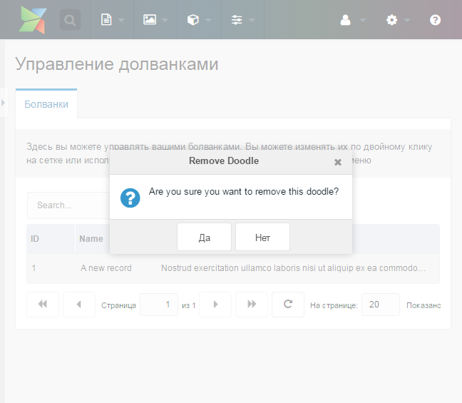

Теперь давайте создадим наш процессор удаления

*doodles/core/components/doodles/processors/mgr/doodle/remove.class.php*

```
<?php

class DoodleRemoveProcessor extends modObjectRemoveProcessor {
    public $classKey = 'Doodle';
    public $languageTopics = array('doodles:default');
    public $objectType = 'doodles.doodle';
}
return 'DoodleRemoveProcessor';
```

Очень похож с процессором обновления, за исключением того, что в этот раз мы расширяем `modObjectRemoveProcessor`, который обрабатывает удаление `Doodle` из БД.

<div id="create-form"></div>

### Добавление формы создания

Нам нужно добавить кнопку в верхнем тулбаре для запуска окна с формой создания нового элемента. Добавим это к `tbar`: свойство конфигурации сетки в *doodles.grid.js*, сразу после текстового поля поиска на 48 строке. Этот код следуте вставлять после закрывающей фигурной скобки текстового поля поиска (`textfield`) и перед закрывающей квадратной скобкой `tbar`:

*doodles/assets/components/doodles/js/mgr/widgets/doodles.grid.js*

```
{
    text: _('doodles.doodle_create')
    ,handler: { xtype: 'doodles-window-doodle-create' ,blankValues: true }
}
```

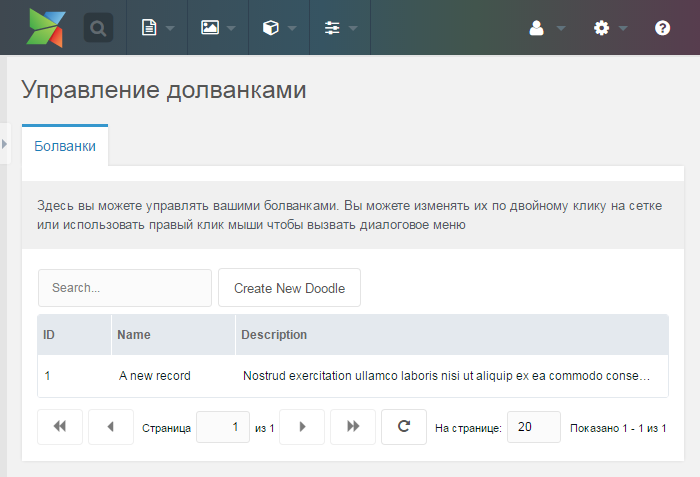

MODExt позволяет передавать JSON объекты внутрь обработчика: метод на тулбарах. Это позволяет загрузить окно с xtype `doodles-window-doodle-create`, убедится в том что эти значения пусты при загрузке и запустить `this.success` при успешной отправке формы окна. Поэтому, давайте определим окно в конце нашего файла:

*doodles/assets/components/doodles/js/mgr/widgets/doodles.grid.js*

```
Doodles.window.CreateDoodle = function(config) {
    config = config || {};
    Ext.applyIf(config,{
        title: _('doodles.doodle_create')
        ,url: Doodles.config.connectorUrl
        ,baseParams: {
            action: 'mgr/doodle/create'
        }
        ,fields: [{
            xtype: 'textfield'
            ,fieldLabel: _('doodles.name')
            ,name: 'name'
            ,anchor: '100%'
        },{
            xtype: 'textarea'
            ,fieldLabel: _('doodles.description')
            ,name: 'description'
            ,anchor: '100%'
        }]
    });
    Doodles.window.CreateDoodle.superclass.constructor.call(this,config);
};
Ext.extend(Doodles.window.CreateDoodle,MODx.Window);
Ext.reg('doodles-window-doodle-create',Doodles.window.CreateDoodle);
```

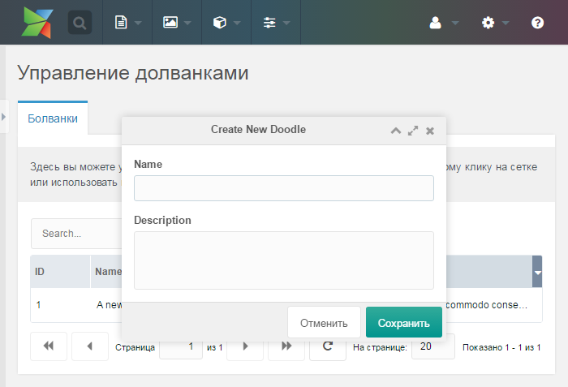

Этот код очень похож с кодом нашего окна обновления данных, за исключением того, что в этом случае у нас нет поля ID и в качестве процессора передаётся `create`. Давайте создадим этот процессор:

*doodles/core/components/doodles/processors/mgr/doodle/create.class.php*

```
<?php

class DoodleCreateProcessor extends modObjectCreateProcessor {
    public $classKey = 'Doodle';
    public $languageTopics = array('doodles:default');
    public $objectType = 'doodles.doodle';
    public function beforeSave() {
        $name = $this->getProperty('name');
        if (empty($name)) {
            $this->addFieldError('name',$this->modx->lexicon('doodles.doodle_err_ns_name'));
        } else if ($this->doesAlreadyExist(array('name' => $name))) {
            $this->addFieldError('name',$this->modx->lexicon('doodles.doodle_err_ae'));
        }
        return parent::beforeSave();
    }
}
return 'DoodleCreateProcessor';
```

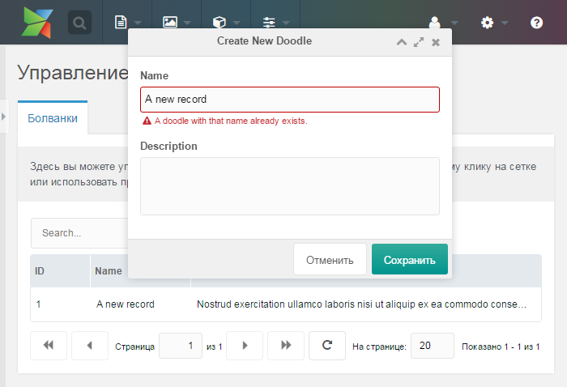

Этот кода также похож с процессорами `update` и `remove`, за исключением того, что мы не захватываем объект, а создаём его. Теперь мы расширяем вспомагательный класс `modObjectCreateProcessor`.

Кроме этого, здесь мы определяем правила валидации - убеждаемся что поле `name` не пустое, в противном случае возвращаем указанное сообщение об ошибке для данного поля. Если поле `name` не пустое, тогда проверяем чтобы не было дублей с таким же значением поля `name`. Чтобы сделать это, мы расширили метод `beforeSave()`, после чего возвратили родительский класс запускающий этот же метод. Затем внутри него мы делаем две вещи:

* Проверяем поле `name` на пустоту и если поле не заполнено, то добавляем сообщение об ошибке
* В противном случае, проверяем нет ли записей с таким же названием (используя вспомогательный метод `doesAlreadyExist()`, который для поиска дублей принимает массив), и если находим запись с таким же именем - также возвращаем ошибку.

Теперь мы создали рабочую форму создания новых записей с валидацией указанных полей.

<div id="adding-inline-editing"></div>

### Добавление инлайнового редактирования сетки

MODExt имеет встроенную возможность инлайнового редактирования сетки. Просто добавьте этот код в ваш объект конфигурации `Doodles.grid.Grid` после свойства `autoExpandColumn` (строка 15):

*doodles/assets/components/doodles/js/mgr/widgets/doodles.grid.js*

```
,save_action: 'mgr/doodle/updateFromGrid'
,autosave: true
```

Это говорит сетке включить инлайновое редактирование и сохранение, а также отправлять все сохраняемые данные в процессор `mgr/doodle/updateFromGrid`. Давайте его создадим:

*doodles/core/components/doodles/processors/mgr/doodle/updatefromgrid.class.php*

```
<?php

require_once (dirname(__FILE__).'/update.class.php');

class DoodleUpdateFromGridProcessor extends DoodleUpdateProcessor {
    public function initialize() {
        $data = $this->getProperty('data');
        if (empty($data)) return $this->modx->lexicon('invalid_data');
        $data = $this->modx->fromJSON($data);
        if (empty($data)) return $this->modx->lexicon('invalid_data');
        $this->setProperties($data);
        $this->unsetProperty('data');
        return parent::initialize();
    }
}
return 'DoodleUpdateFromGridProcessor';
```

Обратите внимание как мы только что расширили наш класс процессора `DoodleUpdateProcessor` (после его подключения), после чего в методе `initialize()` мы выполняем парсинг свойства `data` из JSON (который отправляется нашей сетке с обновлённой записью) и устанавливает его в качестве свойств для данного процессора. Затем процессор `DoodleUpdateProcessor` делает всё остальное.

<div id="summary"></div>

## Итоги

Мы создали пользователький интерфейс, который позволяет создавать, просматривать, обновлять, удалять (CRUD), сортировать даные, а также имеет поиск и постраничную навигацию.

В 3-й части мы будем изучать создание транспортного пакета для нашего дополнения - это позволит нам распростанять его на [modx.com](https://modx.com/extras/?product=revolution) и устанавливать через *Приложения / Установщик*.