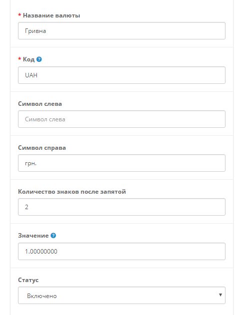

# Добавление валюты

Для добавления новой валюты:

* Переходим в *Settings / Localisation / Currencies*
* Добавляем новую валюту и удаляем не нужные если есть необходимость
* Изменяем валюту по умолчанию в основных настройках магазина, если в этом есть необходимость

