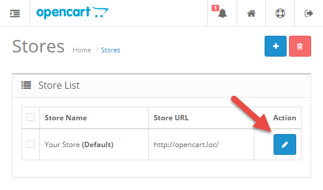
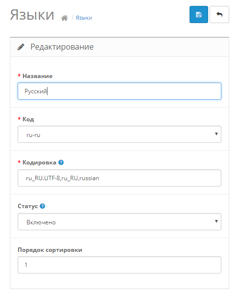
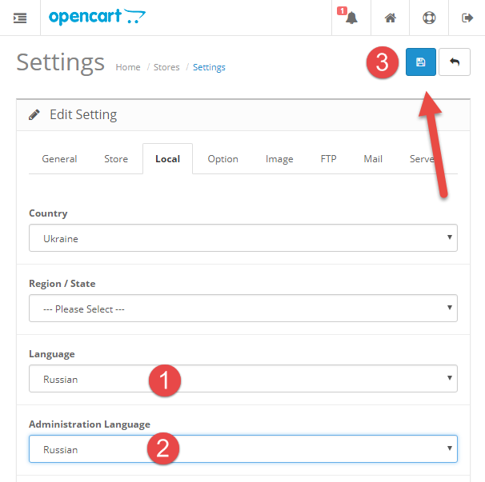

# Руссификация

* Загружаем файлы локализации
* Переходим в меню *Settings / Localisation / Languages* и добавляем новый язык

* После добавления языка переходим *Settings / Stores* и кликаем по кнопку редактирования магазина

