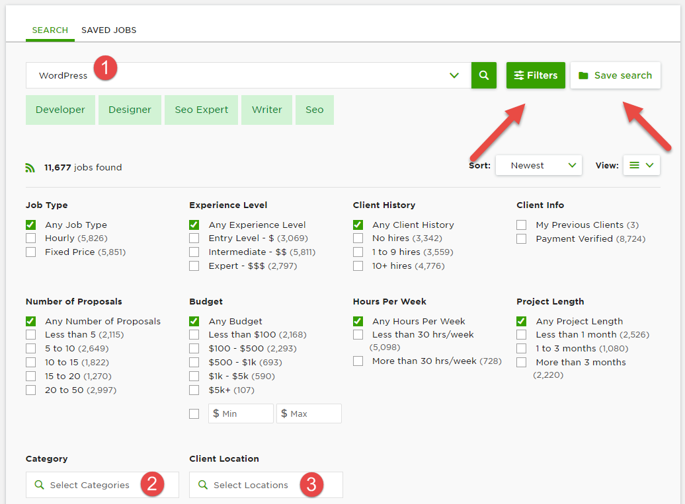
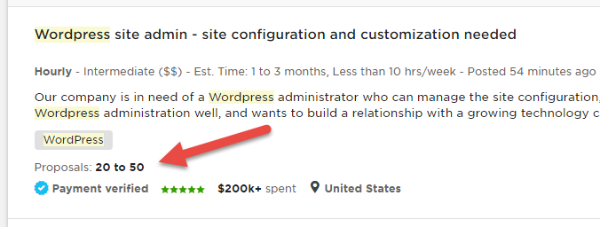
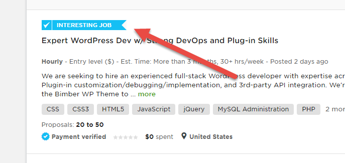
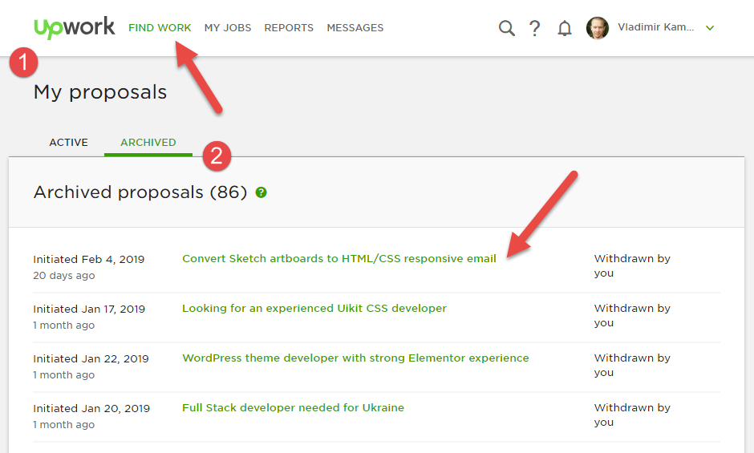
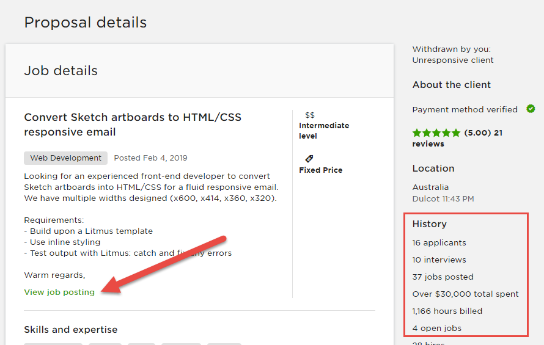
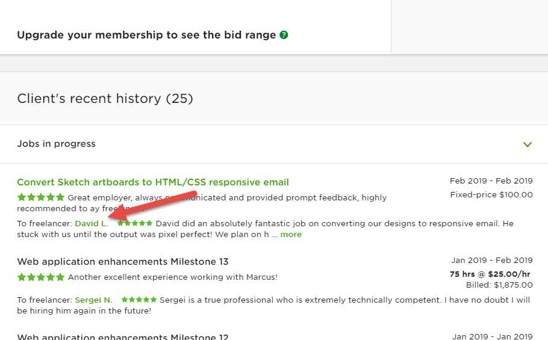
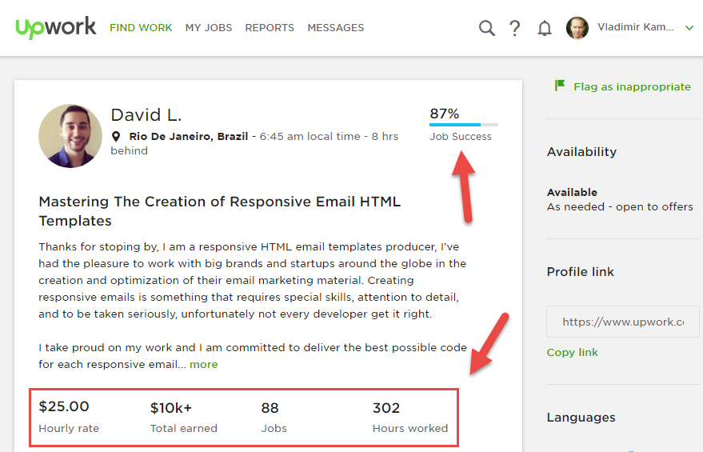

# Путь в Top rated и стабильный 1 000$ в месяц на Upwork

* [Выбор специализации](#choose)
* [Заполнение профиля](#profile)
* [Поиск заказов](#search)
* [Выбор клиента](#client)
* [Сопроводительное письмо](#letter)
* [Собеседование](#interview)
* [Успешность фрилансера](#jss)

## Выбор специализации

В условиях высокой конкуренции, которая существует на Upwork, выигрывает тот специалист, который может решить конкретные задачи клиента, а не занимается всем подряд.

Должен быть спрос на выбранное вами направление - воспользуйтесь поиском Upwork для того чтобы найти проекты и фрилансеров по вашей нише - вы сможете увидеть бюджеты, требования, необходимые навыки и примерные заработки.

## Заполнить профиль

Нужно заполнить профиль на 100%. Для этого нужно заполнить все разделы и желательно пройти тесты.

Если вы новичок на Upwork, то прохождение тестов поможет вам сформировать более убедительный профиль и таким образом к вам будет больше доверия со стороны клиентов + если у вас ещё не дозаполнен профиль на 100% прохождение тестов поможет с этим.

## Поиск проектов

Чтобы сделать запрос на участие в проекте вам нужны подключения или коннекты (connects) - можно сказать это внутренняя валюта Upwork. Бесплатно вам доступно 60 коннектов в месяц, при этом для подачи заявки требуется как правило 2 коннекта то есть у вас имеется 30 возможностей в месяц чтобы отправить сопроводительное письмо.

Чтобы найти проект нужно настроить фильтры, каждый настраивает под себя, но важно выставить фильтры и сохранить фильтр, чтобы у вас новые проекты в первую очередь показывались по сохранённому фильтру, то есть те проекты, которые вам наиболее интересные.

Когда вы активно ищите новые проекты, можно использовать дополнение для Google Chrome - [Upwork jobs feed tracker](https://chrome.google.com/webstore/detail/upwork-jobs-feed-tracker/gcjmekbfkkmaccloaoccfiohjnmgkddm)

Значки долара, например Hourly - Intermediate ($$) - могут отображать уровень оплаты за работу и уровень сложности задач. Всё логично, чем сложнее задача или проект в целом, тем его стоимость будет дороже.

* Чем раньше (меньше отправленный Proposals по проекту) вы увидете проект и быстрее ответите клиенту, тем больше шансов, что вы получите заказ

* Перед тем как отправлять заявку на участие, изучите самого клиента - сколько он потратил, какая средняя ставка, какие отзывы он оставляет другим фрилансерам (Feedback Score, Credit history, Hire Rate, Budget).
* Следует ориентироваться на проекты где клиенты из англоговорящих более развитых стран, то есть мы сразу фильтруем по Location - США, Англия, Канада, Австралия
* Больше всего заказов примерно из англоязычных стран с 3 ночи до 7 утра

Если проект помеченный ярлыком **Features Job**, то это означает, что изначально коммисия с этим клиентом для вас будет не 20, а 10%.

## Выбор клиента

Желательно выбирать клиента с опытом, хотя иногда можно встретить клиента-новичка на Upwork, но тогда следует смотреть на качество подачи требований по проекту и собственно сам бюджет.

Больше деталей по проекту, понимание реальных сроков и стоимости проекта - определяет хорошего заказчика, с которым редко бывают проблемы.

* Обращайте внимание на средний Horly Rate по которому работает клиент, потому что по этому фактору определяется насколько комфортной будет клиенту принять ваши условия.
* Смотрите отзывы - не все хорошие по оплате клиенты, оставляют отзывы вообще или оставляют хорошие отзывы. Наша цель не только заработать деньги, а заработатть деньги, сделать хорошо работу и оставить довольным клиента, который оставит хороший отзыв. По отзывах можно судить какие проекты были опубликованны, на сколько качественно была выполенна работа и какую сумма денег была заплаченна за ту или иную работу.

Можно аназирировать отказы по таким критериям:

* URL, title
* Horly rate freelancer
* Client country
* Average rate client
* Total spend
* Hided rate
* Hired country
* Hired JSS

Как можно аназировать?

## Сопроводительное письмо

Отправлять заявку следует как можно быстрее, поэтому всегда смотрите насколько свежий проект и какая по нему активность (сколько заявок уже отправили другие фрилансеры и сколько было интерью). Быстрее отправили - больше шансов, но не нужно спешить и писать шаблонные письма, всегда ориентируйтесь на требования заказчика.

Ваша цель вынудить заказчика на контакт. А практика уточняющих вопросов продемонстрирует работодателю, что вы глубоко вникаете в суть, стараетесь выяснить все существенные детали и относитесь к заданию серьезно.

Полностью изучите описание проекта и все прилагающиеся документы и покажите клиенту что вы не просто отправили ему письмо, а действительно постарались разобраться с его проблемой. Старайтесь завязать коммуникацию, то есть желательно задавать открытые вопросы, которые заставят клиента начать диалог.

В интерфейсе Upwork, заказчик видит примерно 2 первых строчки вашего письма. Вот в них и стоит написать нечто вроде "Я это сделал вчера или месяц назад. Вот ссылка на пример".

Любой клиент хочет знать, сколько будет стоить его заказ, сколько это времени займет и что он получит.

* Готовьте сопроводительное письмо ориентированное на конкретного заказчика и конкретный проект
* Следует быстро писать Cover Letter, чем быстрее вы напишите сопроводительное письмо, тем больше шансов, что его прочтёт работодатель - используйте слепой набор, заготовки
* Начните с приветсвия - Уважаемый..., Привет..., Добрый день...
* Пишите о проблемах клиента и вашем опыте в этом направлении, чтобы он понял что вы тот кто ему нужен и способны справиться с задачей - Меня зовут, я проффесиональный WordPress разработчик...
* Расскажите о своём опыте - Я уже работал с проектами такого рода в прошлом и имею положительные отзывы от клиентов
* Укажите на особенности или детали, если они есть - В вашем проекте используются такие-то и такие технологии, я с ними прекрасно знаком, делал в таких-то и таких проектах, получилось то-то...
* Выскажите своё мнение - Ваш проект мне очень нравится и я бы хотел принять в нём участие...
* Сориентируйте по сроками и стоимости - Ваша задача или проект примерно займём столько-то времени. По финансам ваша ставка меня устраивает, хотя, вероятно, потребуется больше бюджета, предполагаю, что задача сложнее, чем кажется на первый взгляд.
* Задайте вопросы, это лучший способ открыть коммункацию и начать разговор с клиентом, а также покажет вашу заинтересованость проектом. Часто сами клиенты упускают важные детали в ТЗ - Я прочитал вашу заявку, но есть вопросы...
* Докажите клиенту что вы действительно сможете сделать данный проект и приложите список проектов с похожим функционалом или подобными требованиями - https://sitename.com, верстка, темизация...
* Когда вы доступны - Постоянно доступен с 9 утра до 18 вечера GMT+2 (Киевское время).
* Ещё раз укажите на навыки, которые прямо или коственно указаны в описании проекта - Вы упомянули о..., при этом я...
* Закрывайте продажу и предложите связаться для дальшейшего обсуждения - Я готов приступить к работе, напишите мне чтобы продолжить обсуждения вашего проекта...
* Укажите конкретные шаги и предложение по решении задачи клиента
* Постарайтесь не делать ошибок, но ещё важнее составлять сопроводительное письмо таким образом, чтобы клиент вас смог понять
* Цени конекты и в каждом ответе постарайся максимально зацепить заказчика
* Много текста не надо, но надо по смыслу
* Напишите, сколько ревизиий или правок Вы учли в данном расчете (если речь идёт о дизайне или видео продакшене).

Будьте внимательны к словам и требованиям клиента и проявляйте оригинальность в написании письма клиенту.

## Собеседование

Если вами заинтересовались - это 80% успеха. Говорите правду и будьте убедительными.

Если вы ведете переговоры вне мессенджера Upwork, все ключевые моменты переговоров (объём работ, сроки) в обязательном порядке фиксируйте в переписке на Upwork. Потому что, когда начнётся контракт, и у вас возникнут проблемы, вам нечем будет доказать, что вы о чём-то договаривались с клиентом.

Ни в коем случае не надо делать какую-нибудь работу бесплатно. Бесплатная работа запрещена правилами Upwork - лучше мало, чем нечего.

## Успешность фрилансера

Каждый фрилансер должен стремится построить хорошие долговременные отношения с клиентом - хороший отзывы и долговременная работа залог успешной работы на Upwork. Успешность определяет Job Sucess Score или JSS.

Один отзыв может испортить вам всю работу на Upwork.

На JSS влияет несколько факторов:

* Публичный отзыв - этот отзыв можно изменить (отправив запрос клиенту) или удалить для Top Rated фрилансеров (каждые 3 месяца, после 10 закрытых контрактов).
* Приватный отзыв - можно отследить после закрытого контракта в статистике - это процент клиентов, которые вас рекомендуют. Этот отзыв изменить уже нельзя никаким образом.

Хорошо влияет:

* Долгосрочные контракты

Плохо влияет:

* Проект без активности
* Проект без транзакций

Если клиент закрывает контракт, то он обязан отзыв поставить, если закрывает контракт фрилансер, тогда это от клиента не требуется и он может его не поставить (рекомендуется, если отношения плохие с клиентом).

Чтобы получить хороший отзыв нужно качественно и вовремя выполнить необходимую работу. Всегда получайте от клиента как можно больше деталей, чтобы более точно расчитать количество времени необходимое для реализации проекта и избежать проблем в будущем.

Перед закрытием контракта - уточните доволен ли клиент работой (Всё ли у тебя хорошо, всем ли ты доволен? Поставить хороший отзыв, для меня это важно для будущих работ.). Если не полностью, то можно предложить сделать дополнительную работу бесплатно за хороший отзыв, но делать это нужно очень аккуратно не используя чат Upwork (лучше другие мессанджеры), потому что Upwork может заблокировать ваш аккаунт из-за этого.

Следует закрывать проекты на паузе, потому что как правило временно приостановленный, потом превращается в висяк.