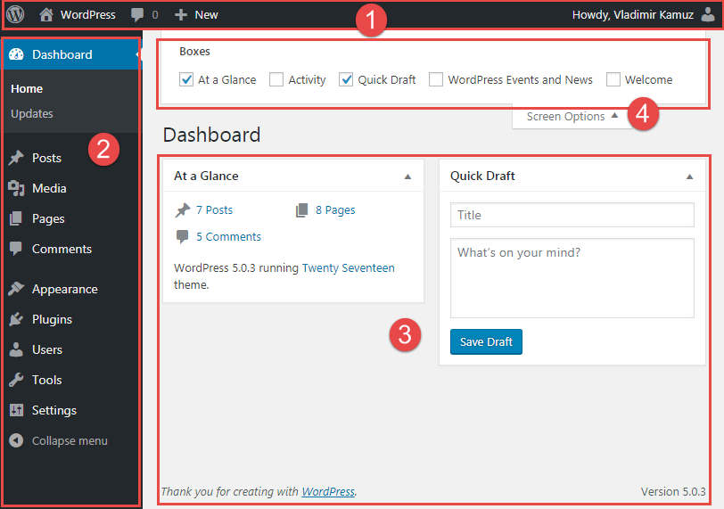
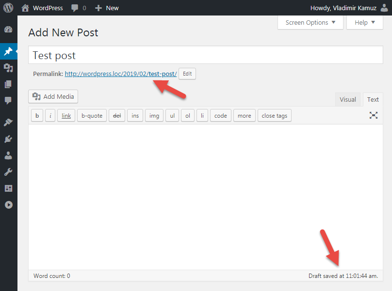
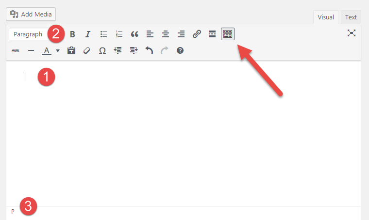

# WordPress базовый

* [Домен и Хостинг](#domain-hosting)
* [Что такое Wordpress](#what-is-wordpress)
* [Преимущества](#advantages)
* [Хостинг или локальный сервер](#hosting-local-server)
* [Две половины Wordpress-сайта](#two-parts)
* [Два типа контента в Wordpress](#posts-pages)
* [Добавление статей](#add-posts)

## Домен и Хостинг

Как программа не может работать без компьютера, так и сайт в интернете не может существовать без домена и хостинга.

**Домен** - это уникальное имя сайта, по которому к нему можно обратится.

**Хостинг** - это ресурсы, которые позволяют ему работать - процессор, БД, жёсткий диск где храняться файлы сайта и т. д. Можно сказать что это специально оборудованный удалённый компьютер для хранения файлов вашего сайта, который позволяет сделать доступными файлы вашего сайта в сети интернет.

## Что такое Wordpress

Любой сайт состоит из 3-х элементов:

1. Код (HTML, CSS, JavaScript)
2. Изображения, статические и медиа файлы
3. Данные (обычно хранятся в БД)

Ранее во времена зарождения интернета, человеку которому нужен был сайт, требовался программист, который мог разработать этот сайт. Но со временем, каждый программист хочет автоматизировать свою работу и начали появляться системы управления сайтом/контентом или CMS.

**CMS** - это веб ориентированная программа, которая которая позволяет упростить процесс создания сайта и публикации контента в интернете. CMS система подходит как для обычных пользователей, которые хотят самостоятельно запустить собственный сайт в интернете так и для профессиональных разработчиков, которые могут настроить какие-то нестандартные возможности для вашего сайта.

**WordPress** - бесплатная (с открытым исходным кодом ) и самая популярная CMS в мире. Распостраяется с лицензией GPL - это универсальная общедоступная лицензция, то есть вы можете использовать эту CMS как в личных так и в коммерческих целях. WordPress состоит из набора исполняемых файлов (PHP, CSS, JavaScript), которые находятся на сервере и позволяют автоматически генерировать страницы сайта.

## Преимущества WordPress

* Бесплатный
* Популярный
    * Большое сообщество разработчиков
    * Каждый 2-й сайт в интернете сделан а WordPress
* Огромное количество тем/шаблонов для быстрого изменения внешнего вида сайта
* Огромное количество плагинов для расширения функционала сайта
* Создавать сайты могут даже не профессионалы используя готовые темы и плагины
* Хорошая зарплата у программистов
* Популярная платформа на рынке труда

## Хостинг и локальный сервер

Чтобы запустить WordPress нужно в первую очередь настроить необходимое окружение (веб-сервер Apache, интерпретатор PHP, и система управления базами данных  MySQL).

Здесь может быть несколько вариантов:

1. Хостинг - мы покупаем хостинг, затем размещаем WordPress на сервере и там уже нам доступны необходимые технологии
2. Локальный сервер - это те же технологии, которые вы можете поставить как программу у себя на компьютере и чтобы разрабатывать сайт, вам не даже не объязательно подключение к интернету. Самые популярные локальные сервера - это XAMPP, MAMP, Open Server, Vagrant, Docker, Local by Flywheel.

## Две половины Wordpress-сайта

Сайт на WordPress состоит из двух частей:

1. Видимая для всех часть сайта или фронт-энд
2. Админ-панель или бэк-энд часть - это закрытая часть сайта, которая доступна только одному или нескольким пользователям (администратор, автор и т. д.), где есть возможность добавлять новый контент на сайт и вносить изменения в настройки сайта.

Админка состоит из

1. Верхняя панель инструментов или тулбар - это контекстно зависимая часть, то есть она может изменяеть свои функции в зависимости от выбратнной страницы. Также эта панель доступная во фрон-энд, если вы зашли как администратор на сайт.
2. Боковая панель инструментов, которую можно сворачивать, как правило она состоит из нескольких частей:
    * Консоль - общая информация, обновление системы
    * Контент - добавление, обновление и удаление страниц, статей, комментарией и пользовательских типов контента
    * Внешний вид и настройки сайта - добавление, обновление и удаление плагинов, тем, меню, пользователей и т. д.
3. Центральная часть с контентом, которая будет менять своё содержимое в зависимости от страницы админ-панели. Каждая страница имеет ряд отдельных элементов, которые можно скрывать или отобжать при помощи настроек экрана (см. ниже) - они называются метабоксами. Кроме того что мы можем скрыть или отображать отдельные метабоксы, мы также можем их перетаскивая, тем самым меняя и закрепляя их положение на странице.
4. Настройки экрана (Screen Options) позволяет отображать или скрывать отдельные части страницы

Главная страница админки называется **Console**, которая может выводить различную полезную информацию, например аналитику или предоставлять доступ к наиболее часто используемых инструментов. Панели в консоли можно перетаскивать или скрывать. Также есть кнопка помощи.

## Два типа контента в Wordpress

У каждого типа контента имееются одинаковые свойства или поля, а также те, которые присущи только отдельному типу контента.

**Записи** - это посты блога, то есть единица контента, которую вы выкладываете на регулярной основе - тестовая заметка, видео, аудиоподкаст, фото галлерея и т. д.

* Добавляются регулярно
* Обязательно относятся к рубрике
* К ним можно добавлять теги или метки
* Их можно комментировать
* Обычно указывается автор и дата публикации
* Обычно не добавляются в меню

**Страницы** - это отдельные страницы, то есть это статичная информация, которая как правило добавляется один раз и очень редко меняется.

* Может иметь родителя/наследника (иерархичность)
* Обычно не указывается дата публикации и автор
* Обычно их нельзя комментировать
* Часто добавляют ссылку на страницу в навигационное меню сайта

## Добавление статей

Как только мы указываем заголовок, то у нас тут же формируется постоянная ссылка (permalink)  и статус публикации черновик (draft).

Теперь, даже если вы покинете текущую страницу без сохранения - она автоматически будет сохраненна как черновик. Вы можете сохранить изменения в черновике, просмотреть черновик на сайте, опубликовать статью (сделать достуной) или отложить дату публикации на указанное время и дату.

Есть два вида редактирования статей - визуальный и текст. Визуальный режим похож на тот который вы используете в Word, а текстовый предназначен для ввода HTML. В визуальном режимое вы можете вставлять контент из Word, после чего будут автоматически применятся стили, которые вы использовали в документе Word, но не всегда это проиходит корректно и зачастую во время такой вставки генерируется много лишнего кода, поэтому хоть и есть такая возможно, но её всё таки нужно использовать осторожно или не использовать вообще.

Предназначение отдельных кнопок в визуальном режиме:

* **Показать дополнительную панель** (Toolbar Toggle) - показать дополнительные инструменты
* **Вставить текст** (Paste as text) - при вставке с Word с помощью этой кнопки применяется дефолтное форматирование, поэтому для корректной вставки текста с Word очень рекомендуется использовать именно эту кноку
* **Очистить форматирование** (Clear formatting) - позволяет отменить визуальное оформление, что также рекомендуется, так как визуальное форматирование лучше делать при помощи CSS.
* **Произвольный символ** (Special character) - позволяет вставить спец символ из семейства Unicode
* **Горячие клавиши** (Keyboard Shortcuts) - отобразит список горячих клавиш. В скролле вниз мы увидим что можно использовать синтаксис Markdown для визуального режима.

Во время редактирования статей или страниц их сохранение может происходить автоматически - этот тип контента называется ревизия (Revision). Они сохраняются как отдельная запись в БД. Вы можете вернуть различное состояние вашей статьи и страницы с помощью выбора отдельных ревизий. Частоту создания и количество ревизий можно ограничить при помощи вненесения изменений в конфигурацию сайт (*wp-config.php*) или используя сторонние плагины.

Для сортировки и изменения позиции постов можно менять дату и время публикации.

Поле цитата (Excerpt) служит для отображения анонса записи. Анонс можно сформировать с помощью тега `<!--more-->`. Править текст содежимого статьи или страницы можно в визуальном или текстовом режиме.

В списке материалов можно производить поиск, использовать быстрое редактирование, удалять или применять груповое редактирование.

Для того чтобы снять с публикации можно просто указать статус Черновик (Draft).

Вставка картинок или медиафайлов, имеет массу опций, например выравнивание с помощью встроенных или инлайновых стилей, обезка, переворачивание и т. д.

При вставке ссылок можно использовать кнопку, а можно скопировать необходимую ссылку, выделить необходимый текст для ссылке в редакторе и использовать комбинацию клавиш <kbd>Ctrl</kbd> + <kbd>V</kbd>. В настройка ссылки можно вы можете выбрать ссылку на внутренние посты или страницы сайта или использовать опцию открытия текущей ссылке в новой вкладке браузера. Если при вставке ссылки в поле ввода вы начнете писать название статьи на вашем сайте, то WordPress поможет вам отыскать её и упростит вставку ссылки на данную статью.
