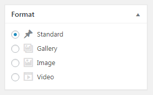
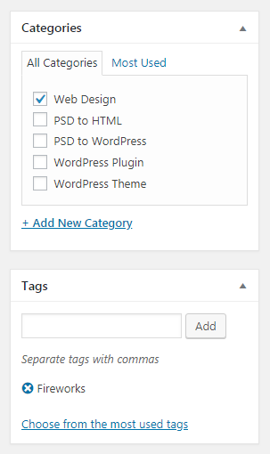
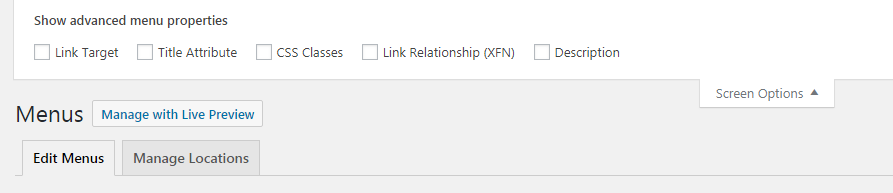

# WordPress базовый

* [Введение](#intro)
* [Домен и хостинг](#domain-hosting)
* [Преимущества](#advantages)
* [Хостинг или локальный сервер](#hosting-local-server)
* [Две половины WordPress-сайта](#two-parts)
* [Два типа контента в WordPress](#posts-pages)
* [Добавление статей](#add-posts)
* [Форматы постов](#post-format)
* [Рубрики и метки](#taxonomy)
* [Медиа контент](#media)
* [Темы](#themes)
* [Меню](#menu)
* [Виджеты](#widges)
* [Настройки темы](#theme-settings)
* [Плагины](#plugins)
* [Пользователи](#users)
* [Инструменты](#tools)
* [Настройки](#settings)
* [Обновление](#update)

<div id="intro"></div>

## Введение

Любой сайт состоит из 3-х элементов:

1. Код (HTML, CSS, JavaScript)
2. Изображения, статические и медиа файлы
3. Данные (обычно хранятся в БД)

Ранее во времена зарождения интернета, человеку которому нужен был сайт, требовался программист, который мог разработать этот сайт. Но со временем, каждый программист хочет автоматизировать свою работу и начали появляться системы управления сайтом/контентом или CMS.

**CMS** - это веб ориентированная программа, которая которая позволяет упростить процесс создания сайта и публикации контента в интернете. CMS система подходит как для обычных пользователей, которые хотят самостоятельно запустить собственный сайт в интернете так и для профессиональных разработчиков, которые могут настроить какие-то нестандартные возможности для вашего сайта.

**WordPress** - бесплатная (с открытым исходным кодом ) и самая популярная CMS в мире. Распостраяется с лицензией GPL - это универсальная общедоступная лицензция, то есть вы можете использовать эту CMS как в личных так и в коммерческих целях. WordPress состоит из набора исполняемых файлов (PHP, CSS, JavaScript), которые находятся на сервере и позволяют автоматически генерировать страницы сайта.

<div id="domain-hosting"></div>

## Домен и Хостинг

Как программа не может работать без компьютера, так и сайт в интернете не может существовать без домена и хостинга.

**Домен** - это уникальное имя сайта, по которому к нему можно обратится.

**Хостинг** - это ресурсы, которые позволяют ему работать - процессор, БД, жёсткий диск где храняться файлы сайта и т. д. Можно сказать что это специально оборудованный удалённый компьютер для хранения файлов вашего сайта, который позволяет сделать доступными файлы вашего сайта в сети интернет.

<div id="advantages"></div>

## Преимущества WordPress

* Бесплатный
* Популярный
    * Большое сообщество разработчиков
    * Каждый 2-й сайт в интернете сделан а WordPress
* Огромное количество тем/шаблонов для быстрого изменения внешнего вида сайта
* Огромное количество плагинов для расширения функционала сайта
* Создавать сайты могут даже не профессионалы используя готовые темы и плагины
* Хорошая зарплата у программистов
* Популярная платформа на рынке труда

<div id="hosting-local-server"></div>

## Хостинг и локальный сервер

Чтобы запустить WordPress нужно в первую очередь настроить необходимое окружение (веб-сервер Apache, интерпретатор PHP, и система управления базами данных  MySQL).

Здесь может быть несколько вариантов:

1. Хостинг - мы покупаем хостинг, затем размещаем WordPress на сервере и там уже нам доступны необходимые технологии
2. Локальный сервер - это те же технологии, которые вы можете поставить как программу у себя на компьютере и чтобы разрабатывать сайт, вам не даже не объязательно подключение к интернету. Самые популярные локальные сервера - это XAMPP, MAMP, Open Server, Vagrant, Docker, Local by Flywheel.

<div id="two-parts"></div>

## Две половины Wordpress-сайта

Сайт на WordPress состоит из двух частей:

1. Видимая для всех часть сайта или фронт-энд
2. Админ-панель или бэк-энд часть - это закрытая часть сайта, которая доступна только одному или нескольким пользователям (администратор, автор и т. д.), где есть возможность добавлять новый контент на сайт и вносить изменения в настройки сайта.

Админка состоит из

1. Верхняя панель инструментов или тулбар - это контекстно зависимая часть, то есть она может изменяеть свои функции в зависимости от выбратнной страницы. Также эта панель доступная во фрон-энд, если вы зашли как администратор на сайт.
2. Боковая панель инструментов, которую можно сворачивать, как правило она состоит из нескольких частей:
    * Консоль - общая информация, обновление системы
    * Контент - добавление, обновление и удаление страниц, статей, комментарией и пользовательских типов контента
    * Внешний вид и настройки сайта - добавление, обновление и удаление плагинов, тем, меню, пользователей и т. д.
3. Центральная часть с контентом, которая будет менять своё содержимое в зависимости от страницы админ-панели. Каждая страница имеет ряд отдельных элементов, которые можно скрывать или отобжать при помощи настроек экрана (см. ниже) - они называются метабоксами. Кроме того что мы можем скрыть или отображать отдельные метабоксы, мы также можем их перетаскивая, тем самым меняя и закрепляя их положение на странице.
4. Настройки экрана (Screen Options) позволяет отображать или скрывать отдельные части страницы


Главная страница админки называется **Console**, которая может выводить различную полезную информацию, например аналитику или предоставлять доступ к наиболее часто используемых инструментов. Панели в консоли можно перетаскивать или скрывать. Также есть кнопка помощи.

<div id="posts-pages"></div>

## Два типа контента в Wordpress

У каждого типа контента имееются одинаковые свойства или поля, а также те, которые присущи только отдельному типу контента.

**Записи** - это посты блога, то есть единица контента, которую вы выкладываете на регулярной основе - тестовая заметка, видео, аудиоподкаст, фото галлерея и т. д.

* Добавляются регулярно
* Обязательно относятся к рубрике
* К ним можно добавлять теги или метки
* Их можно комментировать
* Обычно указывается автор и дата публикации
* Обычно не добавляются в меню

**Страницы** - это отдельные страницы, то есть это статичная информация, которая как правило добавляется один раз и очень редко меняется.

* Может иметь родителя/наследника (иерархичность)
* Обычно не указывается дата публикации и автор
* Обычно их нельзя комментировать
* Часто добавляют ссылку на страницу в навигационное меню сайта
* Поддерживают шаблоны страниц

<div id="add-posts"></div>

## Добавление статей

Есть два вида редактирования статей - визуальный и текст. Визуальный режим похож на тот который вы используете в Word, а текстовый предназначен для ввода HTML. В визуальном режимое вы можете вставлять контент из Word, после чего будут автоматически применятся стили, которые вы использовали в документе Word, но не всегда это проиходит корректно и зачастую во время такой вставки генерируется много лишнего кода, поэтому хоть и есть такая возможно, но её всё таки нужно использовать осторожно или не использовать вообще.


Предназначение отдельных кнопок в визуальном режиме:

* **Показать дополнительную панель** (Toolbar Toggle) - показать дополнительные инструменты
* **Вставить текст** (Paste as text) - при вставке с Word с помощью этой кнопки применяется дефолтное форматирование, поэтому для корректной вставки текста с Word очень рекомендуется использовать именно эту кноку
* **Очистить форматирование** (Clear formatting) - позволяет отменить визуальное оформление, что также рекомендуется, так как визуальное форматирование лучше делать при помощи CSS.
* **Произвольный символ** (Special character) - позволяет вставить спец символ из семейства Unicode
* **Горячие клавиши** (Keyboard Shortcuts) - отобразит список горячих клавиш. В скролле вниз мы увидим что можно использовать синтаксис Markdown для визуального режима.

Для сортировки и изменения позиции постов можно менять дату и время публикации.

Поле отрывок (Excerpt) служит для отображения анонса записи. Анонс можно сформировать с помощью тега `<!--more-->`. Править текст содежимого статьи или страницы можно в визуальном или текстовом режиме. Это поле может использоваться, а может не использоваться темой оформления и этому полю можно найти различное применение (архив метки, результаты поиска, RSS лента и т. д.)

В списке материалов можно производить поиск, использовать быстрое редактирование, удалять или применять груповое редактирование.

Для того чтобы снять с публикации можно просто указать статус Черновик (Draft).

Вставка картинок или медиафайлов, имеет массу опций, например выравнивание с помощью встроенных или инлайновых стилей, обезка, переворачивание и т. д.

При вставке ссылок можно использовать кнопку, а можно скопировать необходимую ссылку, выделить необходимый текст для ссылке в редакторе и использовать комбинацию клавиш <kbd>Ctrl</kbd> + <kbd>V</kbd>. В настройка ссылки можно вы можете выбрать ссылку на внутренние посты или страницы сайта или использовать опцию открытия текущей ссылке в новой вкладке браузера. Если при вставке ссылки в поле ввода вы начнете писать название статьи на вашем сайте, то WordPress поможет вам отыскать её и упростит вставку ссылки на данную статью.

Во вкладке редактора **Text** сможете увидеть и если нужно сможете изменить исходный код HTML, который вместо вас генерирует визуальный редактор.

### Публикация поста

Есть несколько статусов публикации:

* **Опубликованно** - то есть доступно публично
* **Черновик** - то есть запись доступна только из админки
* **На утверждении** - в основном применяется в тех случаях, когда над одной статьей трудится несколько человек при этом у каждого из них своя роль (Автор, Редактор). Автор может создать пост, а Редактор проверить и уже опубликовать на сайте.

Как только мы указываем заголовок, то у нас тут же формируется постоянная ссылка (permalink)  и статус публикации черновик (draft).


Теперь, даже если вы покинете текущую страницу без сохранения - она автоматически будет сохраненна как черновик. Вы можете сохранить изменения в черновике, просмотреть черновик на сайте, опубликовать статью (сделать достуной) или отложить дату публикации на указанное время и дату.

Во время редактирования статей или страниц их сохранение может происходить автоматически - этот тип контента называется **ревизия** или редакция (Revision). По сути это своеобразный бэкап и сохранение отдельных состояний вашей записи. Они сохраняются как отдельная запись в БД. Вы можете вернуть различное состояние вашей статьи и страницы с помощью выбора отдельных ревизий. Частоту создания и количество ревизий можно ограничить при помощи вненесения изменений в конфигурацию сайт (*wp-config.php*) или используя сторонние плагины.

В настройках публикации мы можем **прикрепить запись** - это означает что она будет установливаться выше остальных записей и при добавлении более новых записей, она не будет сдвигаться. Как правило в темах, прикреплённую запись стилизуют иначе обычных постов.

В настройках видимости мы можете закрыть доступ к посту по определённому паролю или сделать возможным просматривать запись только лично вами и больше никому другому.

Если вы укажите будущую дату публикации, то статус вашей записи изменится на **запланированную**, которая опубликуется автоматически в назначенное время.

<div id="media"></div>

## Медиа контент

Весь медиа контент можно разделить на:

1. **Локальный** - хранится в базе данных или в виде файлов на сервере (фото, видео, аудио)
2. **Встраиваемый** - используются внешние источники (YouTube, Instagram)

После загрузки файла изображения и перед вставкой его в статью, можно указать дополнительные параметры - заголовок, подпись, альтернативный текст, размер изображения, сделать ссылкой и т. д. Во время загрузки изображения автоматически сгенерируется несколько изображений с несколькими размерами, которые задаются в настройках сайта и определяются самой темой.

Кроме этого в WordPress есть встроенный редактор фото, который поддерживает базовые операции - обрезка, переворачивание, изменение размеров, изменение пропорций.

Для работы с медиа файлами предусмотрен отдельный раздел в админ-панели, а также для каждого медиа файла создаётся отдельная страница с собственным URL и оформлением на сайте (задаётся темой). Как правило такие страницы практически бесполезны и получают статус поискового мусора, что только вредит вашему сайту при SEO оптимизации, поэтому часто такие страницы закрывают от индексации и настраивают редиректы.

Также, при вставке медиафайла вы можете создать галлереи из изображений, видео или аудио, а также определить миниатюру для поста или вставить встраиваемый контент.

Размеры отображаемой миниатюры задаются как правило темой оформления. Во время шаринга для соц. сетей как правило подхватывается именно эта картинка.

Встраиваемый контент можно вставлять напрямую указав ссылку, либо через функцию **Поделится** (например YouTube или SoundCloud).

В медиа библиотеке у вас есть можность:

* Сортировать, фильтровать, удалять, редактировать, добавлять
* Множественный выбор и пакетное удаление файлов
* Изменение отображения файлов - плиткой и списком

Когда вы загружаете файл при редактировании статьи, то он закрепляется за этой заметкой или страницей (посмотреть можно если использовать вариант отображения списком), а когда вы загружаете файлы через медиа-библиотеку, то нет.

<div id="post-format"></div>

## Форматы постов

Нужны для того чтобы изменять внешний вид постов и функционал в зависимости от выбранного поста (стандартный, заметка, видео, аудио, цитата и т. д.). Поддержка форматов определяется конкретной темой оформления, то есть одни темы могут поддерживать различные форматы постов, а другие нет.



<div id="list-pages"></div>

## Список страниц

Можно выполнять поиск, делать сортировку, фильтрацию (выпадающий список, кликабельные ссылки), групповые операции (изменить статус, добавить категории или метки и т. д.), быстрое редакторование. После удаления статьи или страницы - она удаляется не полностью, а перемещается в корзину, после чего от туда можно уже страницу востановить или удалить безвозвратно.

<div id="taxonomy"></div>

## Рубрики и метки

Рубрики/категории и метки хоть и реализованны по разному, но служат одной и той же цели - структуризации контента для более удобного поиска постов.



Категории могут иметь несколько уровней вложенности (поддержка иэрархии), а теги/метки нет - это по сути основное отличие между ними. И одни и вторые можно создавать из отдельного раздела или на странице создания заметки. Также можно создавать свои собственные таксономии и расширять добавлением новых полей через плагин (ACF, Carbon Fields) или используя WordPress API.

<div id="themes"></div>

## Темы

Тема используют для того чтобы изменить внешний вид сайта, то кроме этого в неё можно поместить любой функционал, который возможно реализовать через плагин (это не желательно).

В репозитории WordPress тысячи тем, но часть из них уже устаревшние, а часть имеют обрезанный функционал, а полный функционал доступно на платной основе. Выбирайте плагины по рейтингу, частоте обновления и популярности. Самый популярный маркетплейс WordPress шаблонов - это ThemeForest. Если вы скачиваете платную тему из открытых источников очень легко подхватить вирус, поэтому будьте весьма осторожны, чтобы избежать лишней головной боли в будущем.

В разделе управления темами можно искать, фильтровать, установить, активировать, обновлять и удалять темы. Установка темы сводится к скачиванию/загрузке и распаковки файлов темы в папку *wp-content/themes/*.

<div id="menu"></div>

## Меню

У любого меню есть структура (элементы меню и их иерархия) и положение и внешний вид меню (опреляются в теме).

Можно создать любое количество меню. Меню можно создавать из раздела *Appereance / Menus*, также с помощью виджетов *Appereance / Widgets*. Места для виджетов и навигационных меню определяются в теме оформления.

Кроме страниц и отдельных постов, мы можем добавлять в меню произвольные ссылки, рубрики или виджеты. Меню могут иметь несколько уровней вложенности. Порядок и вложенность элементов меню достигается за счёт простого перетаскивания элементов.

В разделе *Appereance / Menus / Manage Locations* можно назначать необходимую область определённому меню.

В **Screen Options** можно отобразить и использовать дополнительные свойства элементов меню.



<div id="widgets"></div>

## Виджеты

Это блоки со статической (текстовая информация или HTML код) или динамической информацией (последние комментарии, форму поиска и т. д.), которые можно выводить на сайте в определённых местах темы. Виджеты также есть в операционных системах для компьютера (Windows) или смартфона (Android).

Места куда можно вставлять виджеты определяются в самой теме, то есть в одной теме их может быть больше, а в другой меньше.

Неактивные виджеты позволяют временно отключить, а потом снова включать на сайт с теми же настройками.

Порядок размещения виджетов меняется простым перетаскиваем.

<div id="theme-settings"></div>

## Настройки темы

Настройки темы ещё называют Customizer, хотя настройки темы могут также иметь дополнительный раздел в админке, всё зависит от реализации самой темы. Набор настроек и количество параметров определяются темой оформления, например:

* Изменить название сайта и описание
* Логототип и favicon
* Цветовая схема сайта
* Изменение меню и виджетов
* Отображать статичную страницу или список постов на главной и т. д.

Также в настройках темы есть редактор, который позволяет работать с файлами темы непосредственно из админ-панели WordPress.

<div id="plugins"></div>

## Плагины

**Плагин** - это программные файлы, которые позволяют расширять функционал WordPress не изменяя при этом файлы ядра. Также и в случае с темами, их можно устаналивать непосредственно из админки или с помощью архива, который нужно предварительно распаковать в папку *wp-admin/plugins/*.

Перед установкой плагина рекомендуется посмотреть на его рейтинг, а также количество скачиваний - это позволит понять стоит ли его устанавливать или нет. Кроме этого регулярное обновление и наличие нормальной документации, гарантируют что данный плагин и в будущем будет развиваться.

* Contact Form Honeypot
* Limit Login Attempts Reloaded
* Mistape
* Attachment Pages Redirect
* Akismet Anti-Spam

<div id="users"></div>

## Пользователи

Новый пользователь по умолчанию регистрируются с правами подписчика. Есть несколько ролей, которые имеют разные права для работы с системой - чем дальше вниз по списоку ролей, тем больше привелегий. Новые роли можно расширять с помощью дополнительных плагинов.

Вместо обычного поля для загрузки аватара используется сервис Gravatar, чтобы ваш аватар загружался автоматически для каждого сайта, который использует WordPress.

<div id="tools"></div>

## Инструменты

Это функционал системы, который позволяет выполнять какие-то полезные действия, например делать импорт и экспорт записей. Количество инструментов может увеличиватся после установки новых плагинов.

<div id="settings"></div>

## Настройки

Настройки разбиты на несколько разделов и позволяют гибко сконфигурировать систему - настроки пользователей, форматы даты и времени, размеры миниатюры при загрузке новых изображений, формат URL и т. д.

### Наcтройка ЧПУ

Переходим в раздел *Settings / Permalinks / Common Settings / Custom Structure*. Теперь в поле ввода нам нужно ввести:

```html
/%category%/%postname%.html
```

После чего вместо указанных плесхолдеров будут подставляться название категории и поста с раширением *.html* в конце.

Вот полный список тегов-заполнителей (плесхолдеров):

* `%year%` - год публикации поста, например `2004`
* `%monthnum%` - месяц публикации поста, например `05`
* `%day%` - день публикации поста, например `28`
* `%hour%` - часы публикации поста, например `15`
* `%minute%` - минуты публикации поста, например `43`
* `%second%` - секунды публикации поста, например `33`
* `%post_id%` - уникальный ID поста, например `423`
* `%postname%` - отформатированная версия заголовка поста, например заголовок `This Is A Great Post!` станет в URL `this-is-a-great-post`
* `%category%` - отформатированная версия названия категории
* `%author%` - отформатированная версия имени автора

Если заголовки страниц вы пишите на русском, то вам нужно будет вручную изменять настройки постоянных ссылок переводя их транслит. Помимо этого, можно установить плагин [Cyr to Lat enhanced](https://wordpress.org/plugins/cyr3lat/), который будет автоматически делать транслитерацию.

Можно также заменить префиксы для названия категорий и тегов.

### Настройка комментариев

Во время модерации комментариев можно вручную отмечать определённые комментарии как спам, но можно делать это автоматически используя плагин Akismet. Для его использования нужно сгенерировать API ключ и аккаунт на WordPress.com.

<div id="update"></div>

## Обновление системы

Перед началом рекомендуется бэкап всего сайта включая файлы и БД. Можно делать выполнять автоматическое обновление в один клик, а можно выполнять в ручном режиме, распаковав с заменой новую версию WordPress. Чем чаще вы будете делать обновление, тем меньше вероятность того что во время автоматического обновления вы получите какую-нибудь ошибку.