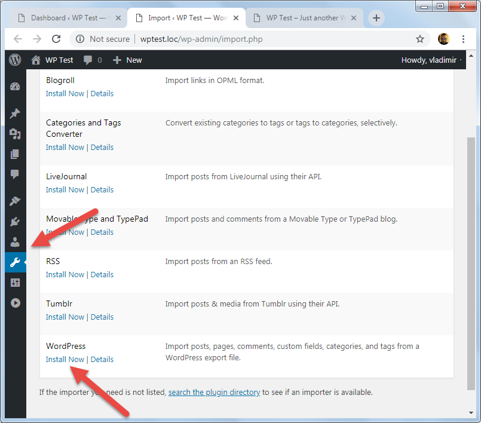

# Импорт тестовых данных

По умолчанию у нас во время установки добавляется только малая часть текстовых данных:

* 1 опублиованная страница и одна страница в черновике
* 1 пост
* 1 рубрика. Все записи которые мы создаём и не присваиваем для них рубрику попадают в рубрику по умолчанию - **Без рубрики**.
* 1 комментарий

Для наполнения сам большим количеством тестовых данных, нужно использовать **Theme Unit Test**. По сути это файл для импорта в формате *.xml*.

Для импорта файлов нужно активировать инструмент импорта WordPress.

После установки, нам нужно импортировать скачанный файл *themeunittestdata.wordpress.xml*.

В настройках импорта можно:

* Указать авторов для записей
* Скачать и импортировать вложения

У нас импортируются записи, комментарии, страницы, медиа файлы, рубрики, метки. Записи, комментарии и страницы могут иметь создаваться различными пользователями, разные статусы, типы записей, объём данных и т. д.