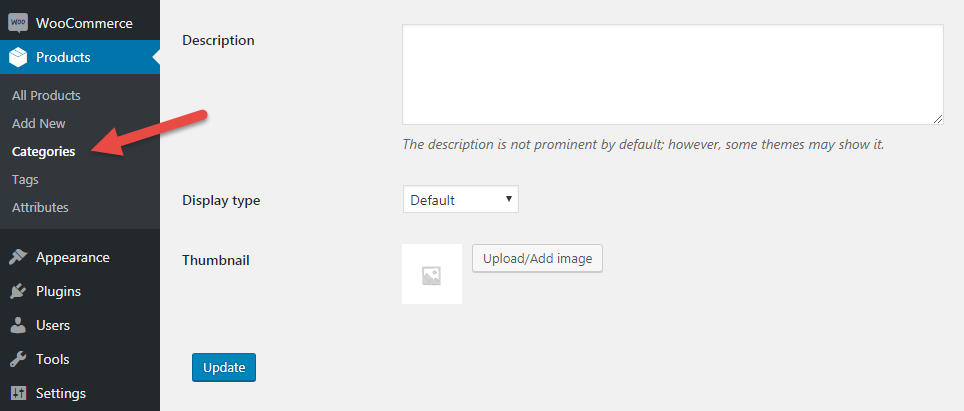

# Добавление категорий и меток

Лучше всегда добавлять категории для более удобного поиска необходимых продуктов. Вы можете добавлять вложенные категории или прикреплять миниатюру к категории, чтобы потом можно было это использовать где-то в шаблоне.

Теги в большистве случаев не используются и применяются в том случае, когда по мимо основной категории, вы хотите ещё как то фильтровать продукты по определённым особенностях продукта.