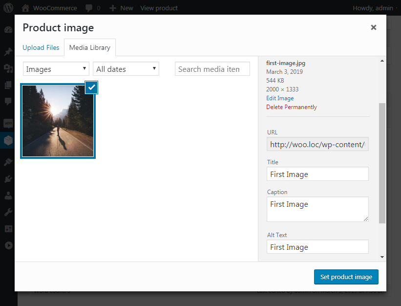

# Добавление изображений к товару

Перед добавлением изображения, желательно его сделать немного SEO оптимизированным - можно проверить на уникальность, а также дать ему человеко-понятное название файла.

Одиночное изображение товара очень похоже на изображение для поста (Featured Image).

Во время загрузки изображения следует изменить Title и добавить Alt Text.

Для изображений мы делаем всё точно также, но в добавок мы можем изменять порядок отображения изображений в галлереи простым перетаскиванием.