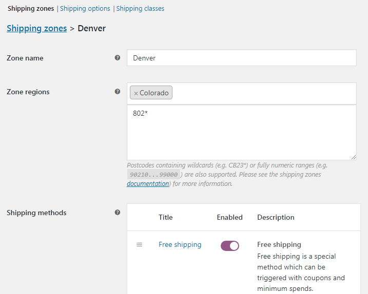

# Создание зон доставки

В настройках WooCommerce переходим во вкладку **Shipping** и вы видим что у нас уже есть предустановленные зоны доставки, но мы также можем создать свои собственные.

Указываем название зоны, потом выбираем регион из списка или ZIP код (диапазон ZIP кодов или wild card нотацию), после чего выбираем метод доставки, для простоты выберем **Free shipping**.

