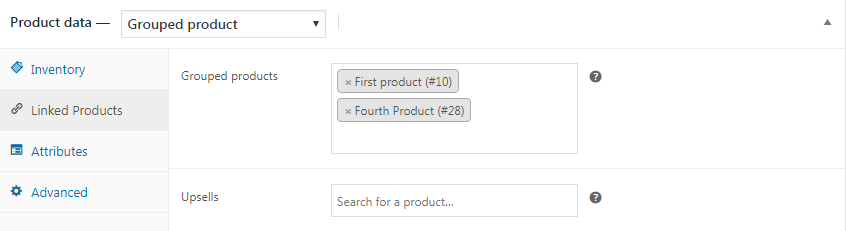
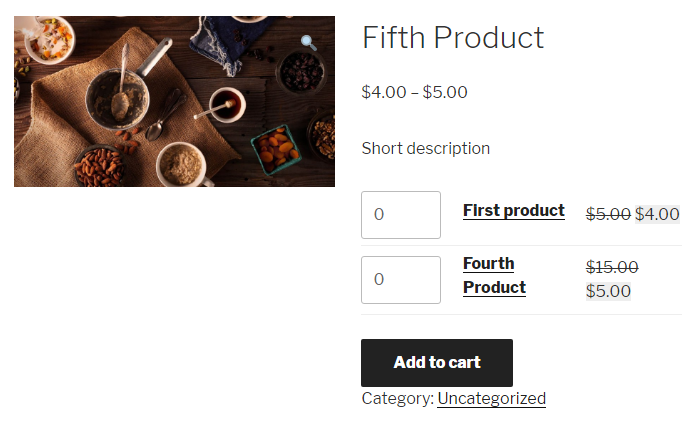

# Груповые товары

Для создания групового товара, нужно просто добавить ссылки на товары.

А так это выглядит во фронт-энд.

Плагин [WooCommerce Product Bundles](#) добавляет новый тип товара **Product bundle** и немного расширяет встроенный функционал групового товара.
