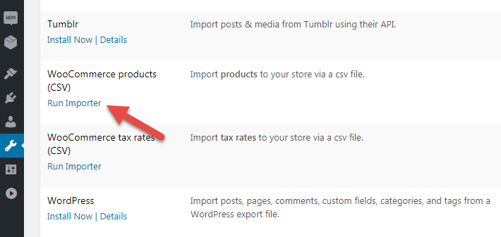

# Импорт товаров

Заходим в меню *Tools / Import* и выбираем.

Файлы импорта можно скачать на сайте WooCommerce, но проще взять из папки плагина WooCommerce *woocommerce/sample-data/sample-product.csv*.