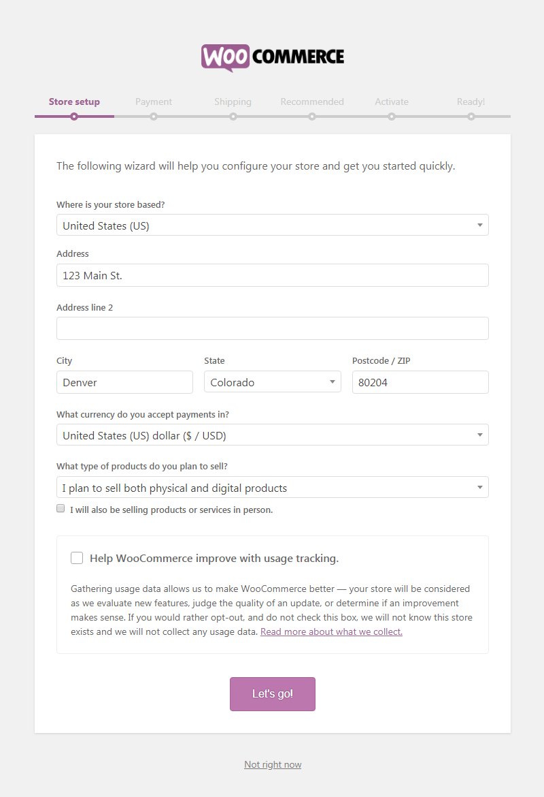
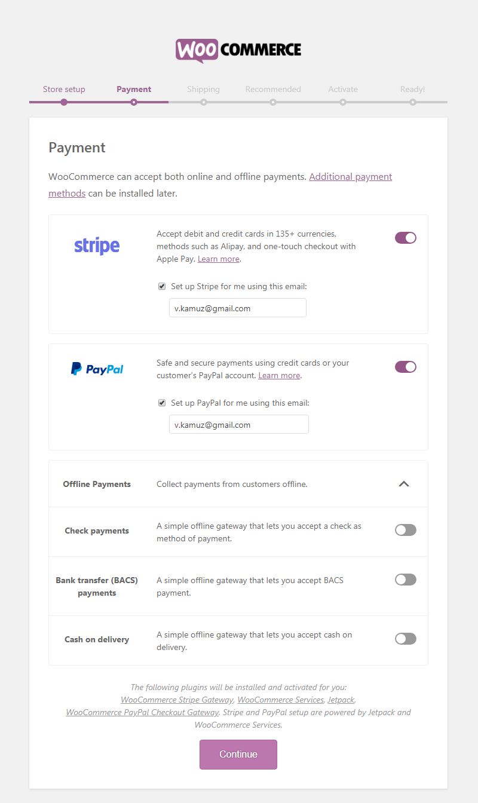
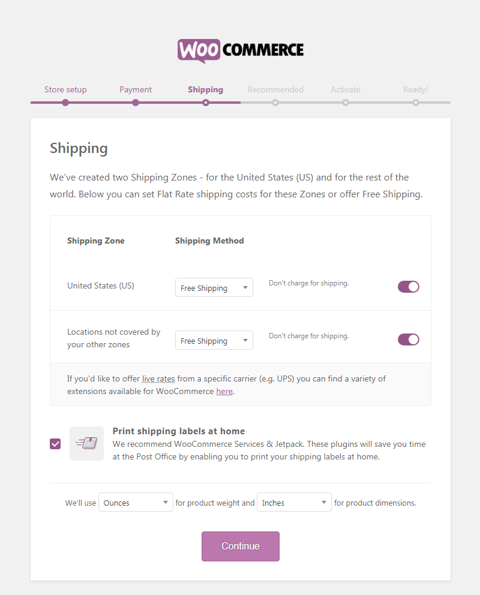
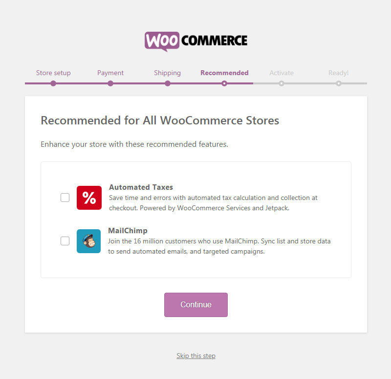
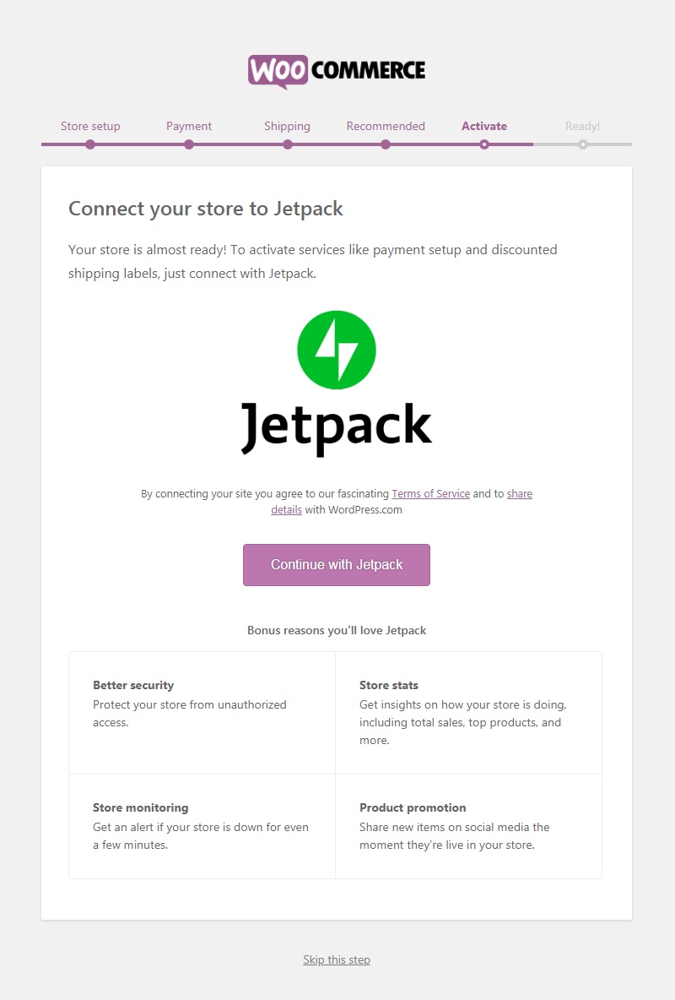
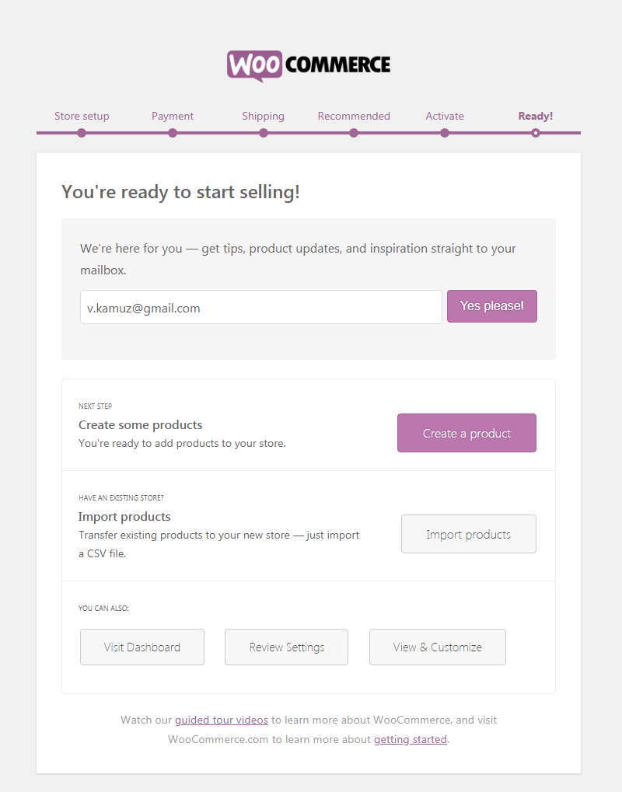
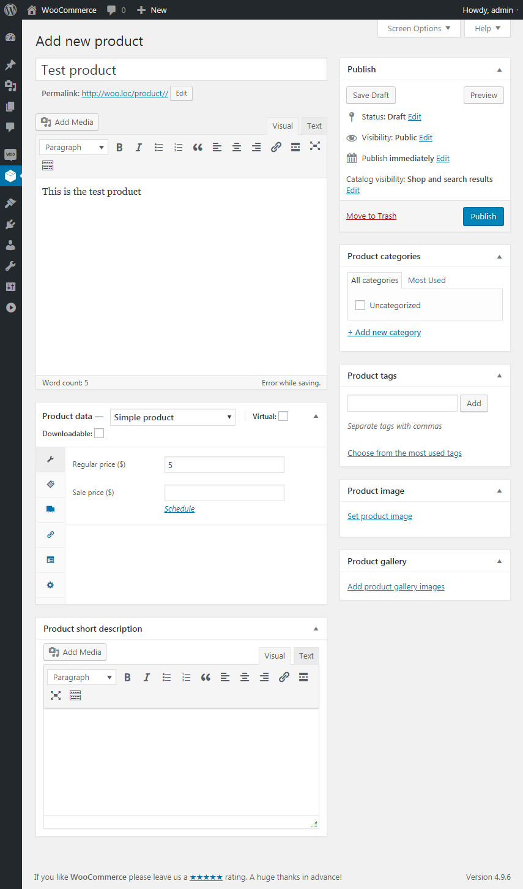
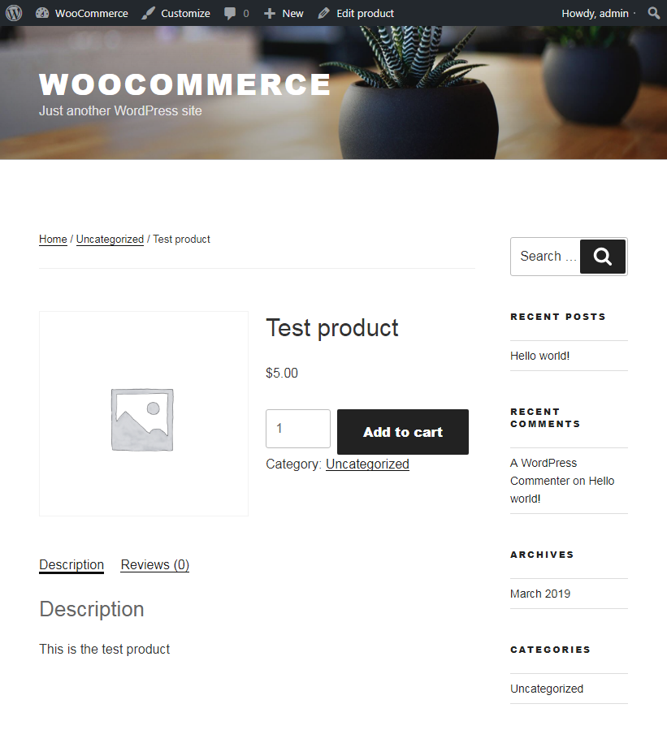

# Установка

После установки и активации плагина WooCommerce нам предлагают пройти процес визуальной настройки:

1. Указываем местонахождение магазина и валюту

2. Выбор платёжного агрегатора и в зависимости от выбранного варианта, будут установленны дополнительные плагины

3. Выбор сервиса доставки и единиц измерения. Возможно также потребуется дополнительная установка плагинов

4. Рекомендованные плагины

5. Использовать или не использовать плагин Jetpack

6. Создать первый продукт самостоятельно или импортировать демо данные с товарами

Пока что создадим первый простой товар самостоятельно с активной темой Twenty Seventeen.

И посмотрим как это будет выглядеть во фронт-энд.

