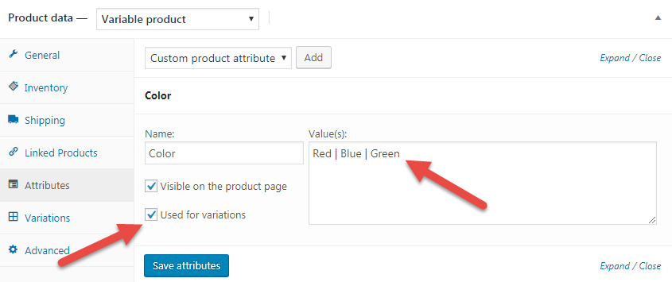
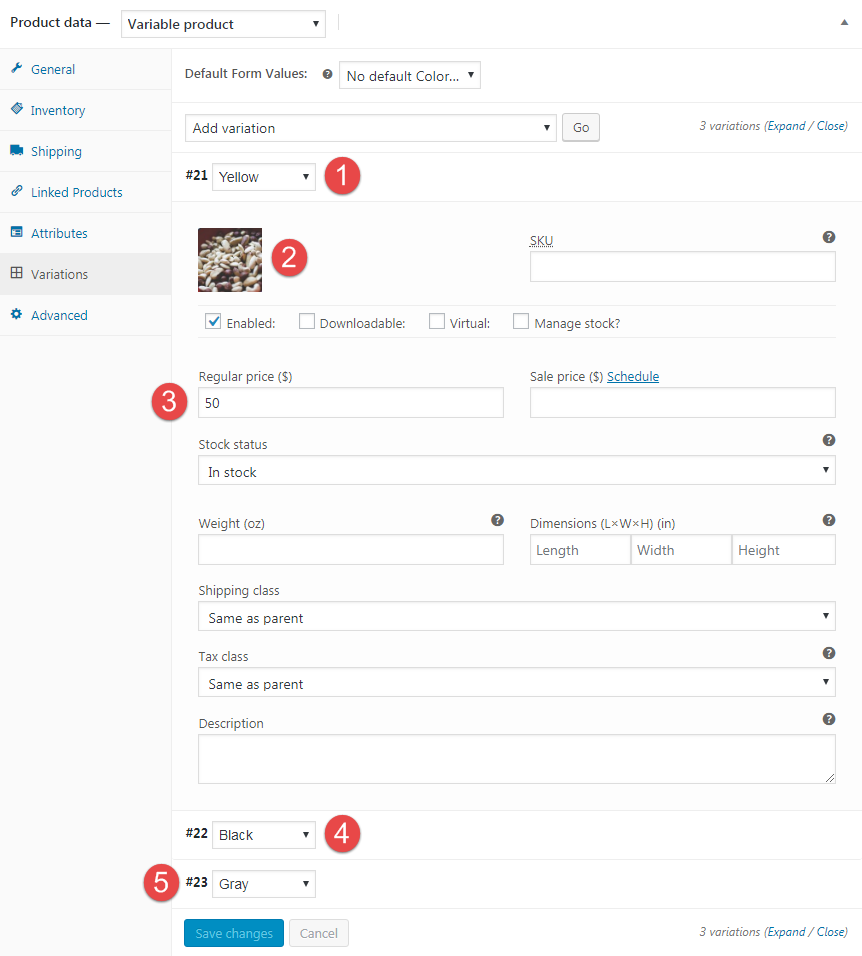
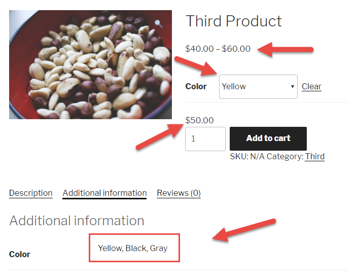
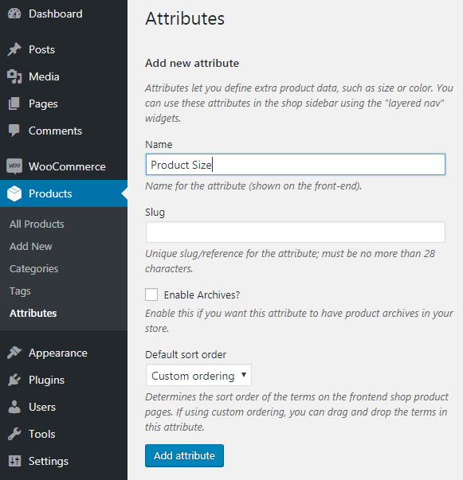
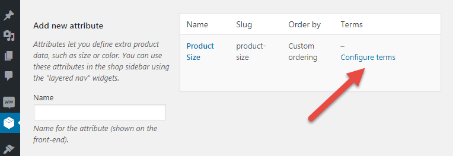
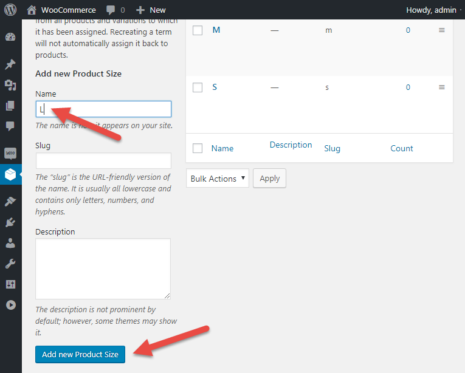
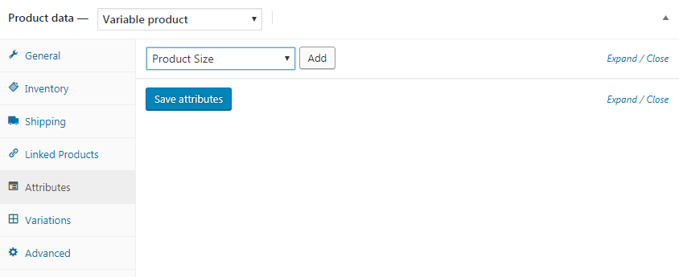
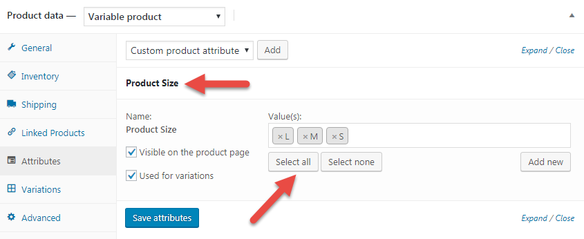
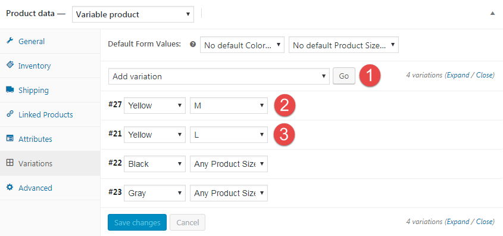
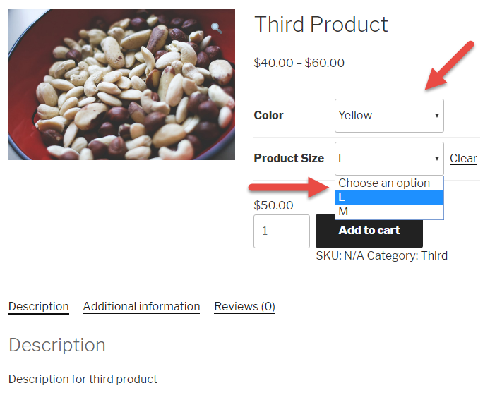

# Вариативные товары

Чтобы добавить вариации товаров, нужно в начале создать атрибуты к товару и установить галочку **Used for variations**.

После этого мы можем уже на основе этих атрибутов создать вариативный товар

В данном случае для всех варианций у нас одна и та же цена.

Но можно установить для каждой вариации свою цену и изображение.

Теперь по умолчанию у нас загружается изображение товара и диапазон цен и как только мы выбираем какой-то атрибут у нас меняется изображение товара и цена.

Но так создавать атрибуты и вариации товара не очень удобно, а более эффективней лучше создавать в отдельном разделе.

И создадим значения для созданного атрибута.

Теперь мы можем добавить новый атрибут к товару.

Выбрав все атрибуты.

Добавим вариации товара.

Посмотрим результат во фронт-энде.

