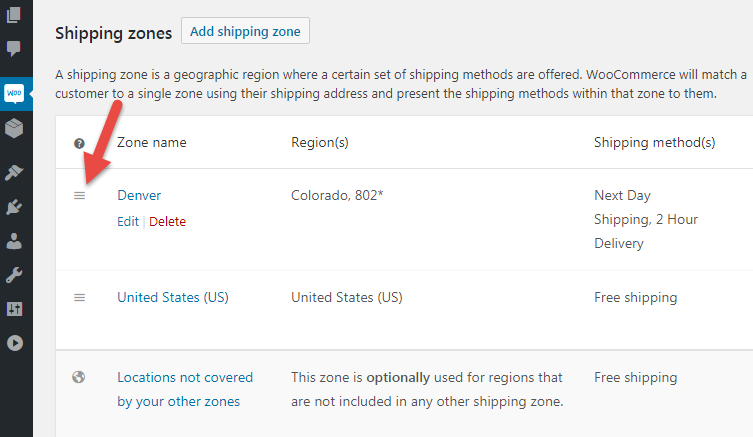
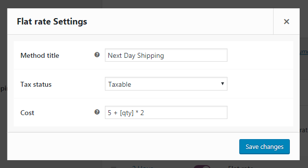
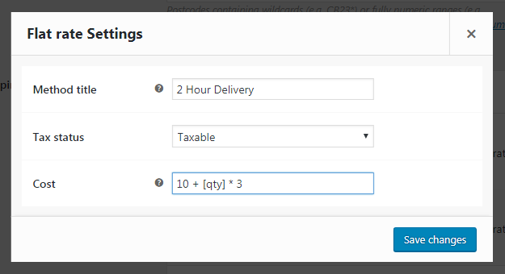
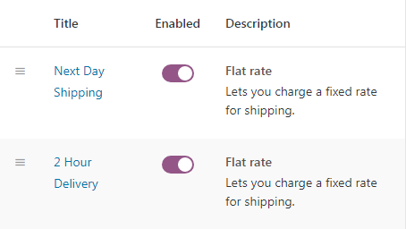
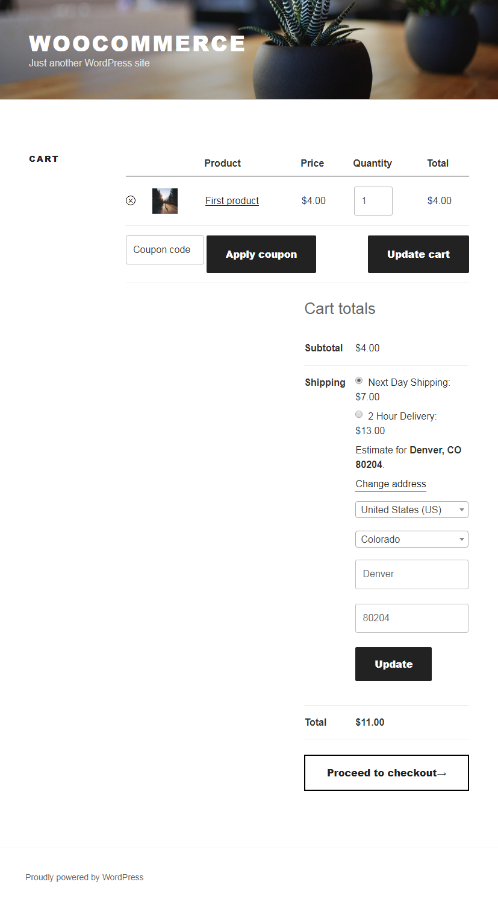

# Установка фиксированной доставки

Поменяем местами зоны доставки, чтобы созданный ранее регион Denver был в самом верху.

Создадим два метода с фиксированной ставкой. Первый на следующий день.

Второй в течении 2 часов.

Как видим, у нас фиксированная ставка расчитывается динамически в зависимости от количества товара.

Проверяем чтобы у нас были включенны эти два метода.

Теперь при оформлении заказа мы можем выбрать необходимый метод доставки, который расчитает стоимость по указанной нами схеме.

Если мы изменим количество товара и обновим корзину, то мы увидим что стоимость доставки у нас также изменится.