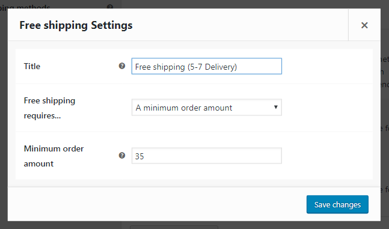

# Настройка бесплатной доставки

Переходим в настройки созданной ранее зоны доставки и добавляем новый метод доставки.

Перетащим на самый верх методов доставки и изменим настройки - название и требования (минимальная сумма заказа $35).

Теперь если вы наберём товаров на $35 и выше, то у нас появится новый вариант доставки.

