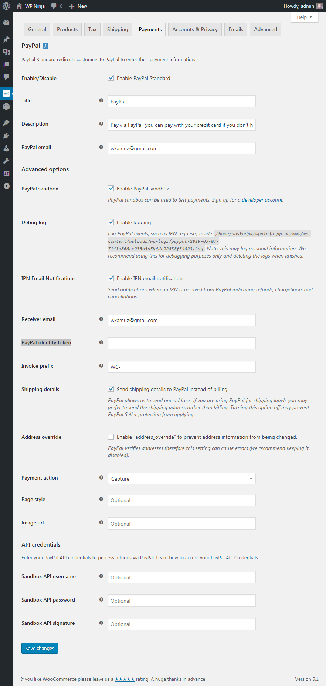
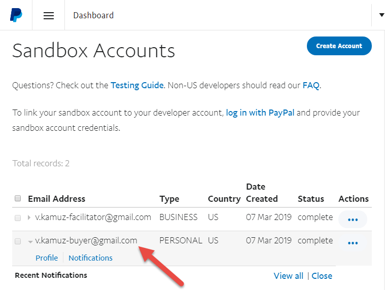
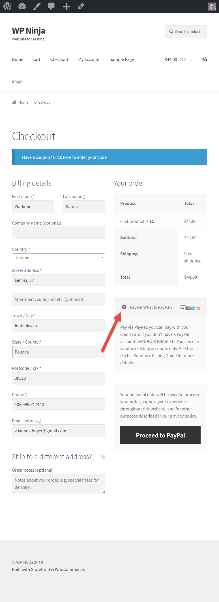
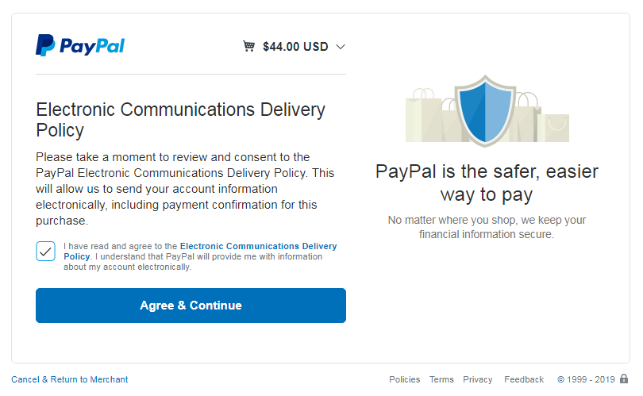
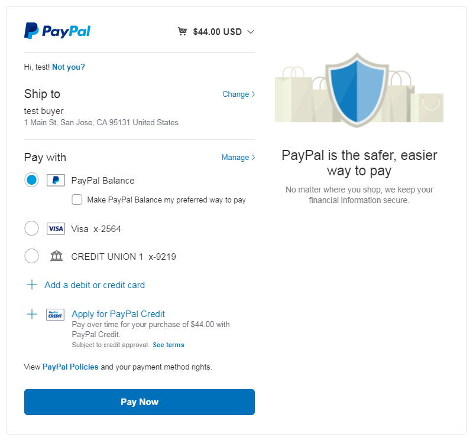
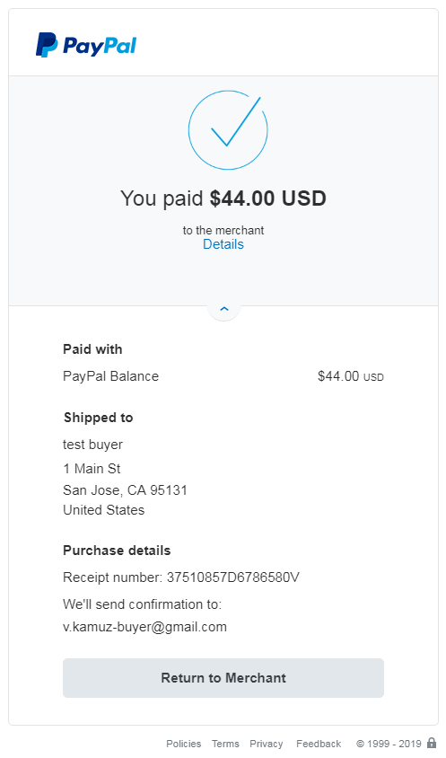
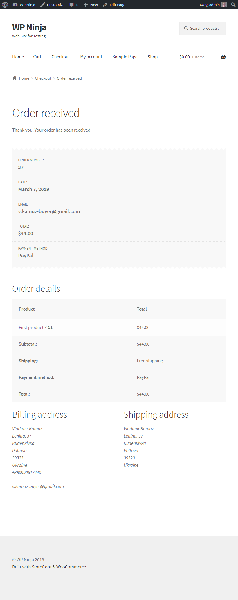
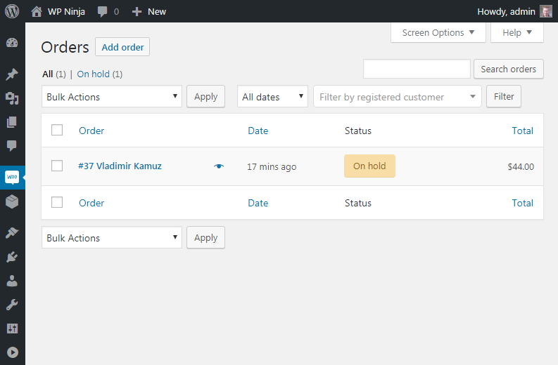

# Настройка PayPal

PayPal прост в настройке как для продавцов, так и для покупателей. Шлюз PayPal, встроенный в WooCommerce и требуется только адрес электронной почты.

По умолчанию используется PayPal Standart (включён в ядро WooCommerce), но если во время процесса начальной установки (welcome wizard) вы включили PayPal, то вы также увидите PayPal Express (используется плагин). PayPal Express можно установить с помощью плагина [WooCommerce PayPal Checkout Payment Gateway](https://wordpress.org/plugins/woocommerce-gateway-paypal-express-checkout/).

Есть несколько расширений PayPal для WooCommerce и если [посмотреть на их сравнение](https://docs.woocommerce.com/document/paypal-extension-comparison/), станет понятно чем именно они отличаются.

Активируем PayPal Standart и изменим настройки.

* **PayPal sandbox** - это тестовая среда это означает, что вы можете совершать транзакции с тестовой покупкой PayPal.
* **Debug log** - eсли у вас возникли проблемы с оплатой загляните в журнал отладки, чтобы увидеть где остановился этот платеж вы можете увидеть ошибку
* **PayPal identity token** - некоторые сайты имеют проблемы с PayPal IPN (Instant Payment Notification) - мгновенное уведомление о платеже отправляемое на ваш сайт. Без этого ваш сайт может не знать что заказ был фактически оплачен в PayPal и будет висеть как неоплаченый в WooCommerce. Чтобы обойти это, вы можете настроить передачу платежных данных (Payment Data Transfer) или PDT в PayPal и обойдет IPN
* **PayPal API** - понадобится в том случае, когда вам нужно будет сделать возврат денег непосредственно в WooCommerce. С включенным API Вы можете пометить заказ как возврат в WooCommerce и заказ будет автоматически будет возвращен в PayPal.

Добавим в корзину товар и попробуем оплатить через PayPal используя PayPal SandBox. Для оплаты нужно использовать тестовые данные, которые вы можете найти по [этому адресу войдя в PayPal](https://developer.paypal.com/developer/accounts/).

Зайдём настройки Sandbox.

Изменим пароль.

Во время оформления заказа выбираем PayPal.

Авторизируемся с тестовыми данными и принимаем условия.

Выбираем вариант оплаты PayPal.

Заказ оплачен.

Заказ принят.

Смотрим изменился ли наш статус заказа.

