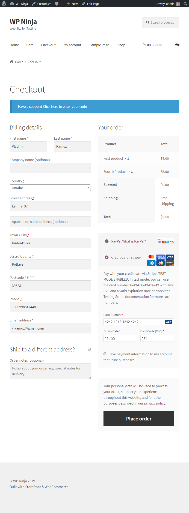
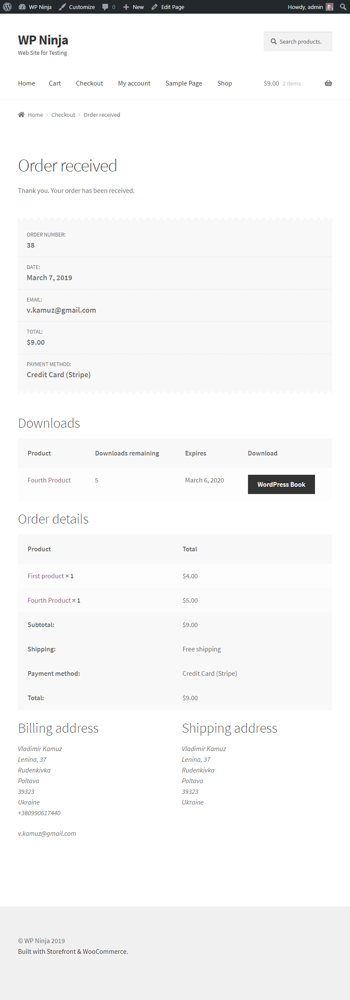
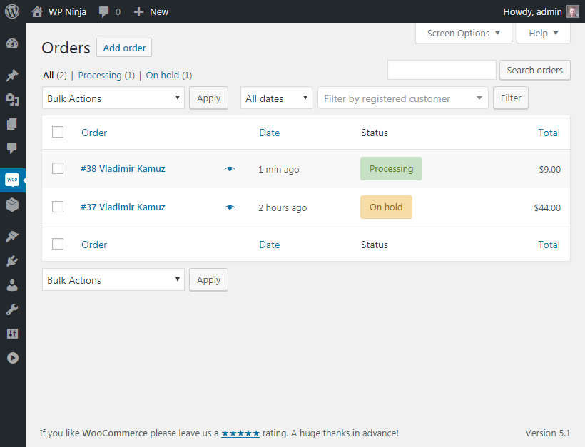

# Настройка Stripe

[WooCommerce Stripe Payment Gateway](https://wordpress.org/plugins/woocommerce-gateway-stripe/) - можно установить отдельно, но также можно было установить автоматически во время первоначальной настройки WooCommerce.

В настройках нужно добавить ключи для live и test режима.

Создадим аккаунт и скопируем ключи.

Добавим их в настройки.

Для получения ключей в демо режиме нужно вводить дополнительные данные, которых у меня нет, потому что я живу в Украине, где Stripe не поддерживается. Поэтому я активировал демо режим в настройках Stripe WooCommerce, добавил ключи для live режима, оформил заказ.

Тестовая оплата прошла.

Статус заказа изменился.

