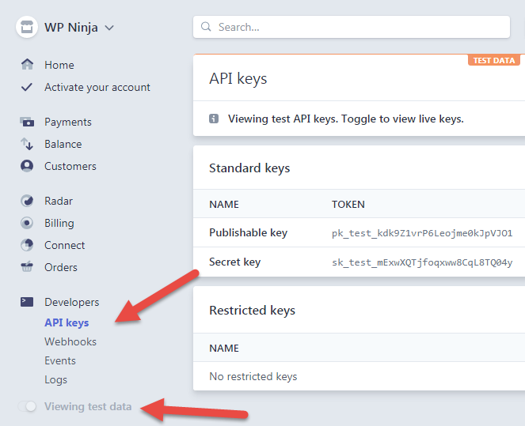
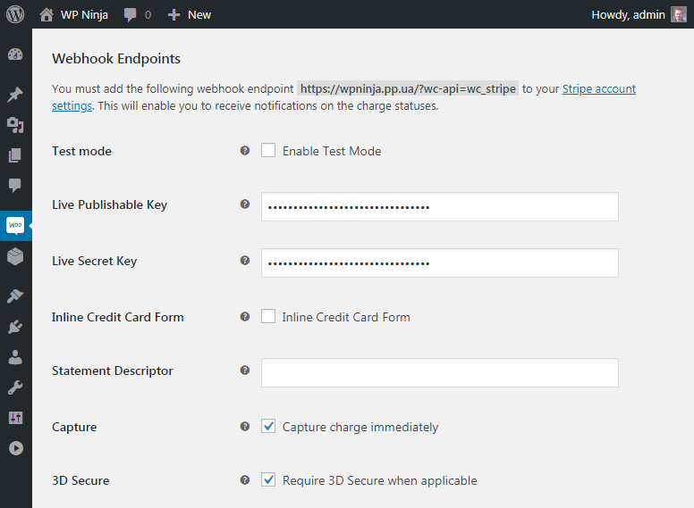
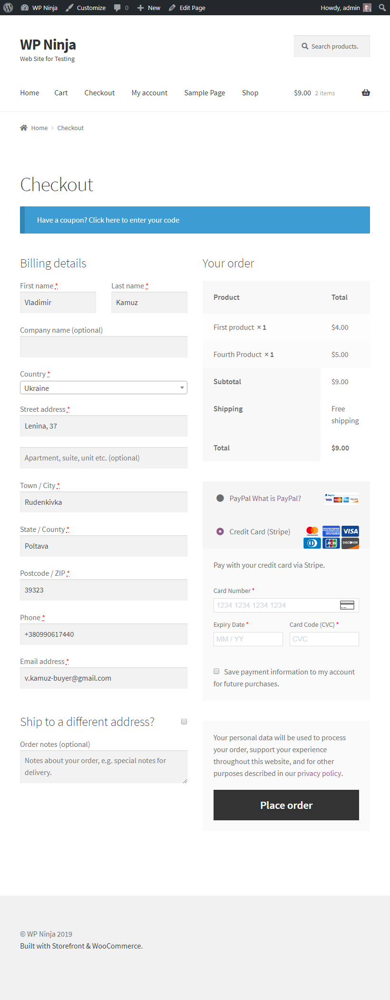

# Настройка Stripe

[WooCommerce Stripe Payment Gateway](https://wordpress.org/plugins/woocommerce-gateway-stripe/) - можно установить отдельно, но также можно было установить автоматически во время первоначальной настройки WooCommerce.

В настройках нужно добавить ключи для live и test режима.

Создадим аккаунт и скопируем ключи.

Добавим их в настройки.

Добавим товаров в корзину и посмотрим появился ли у нас новый вариант оплаты.

