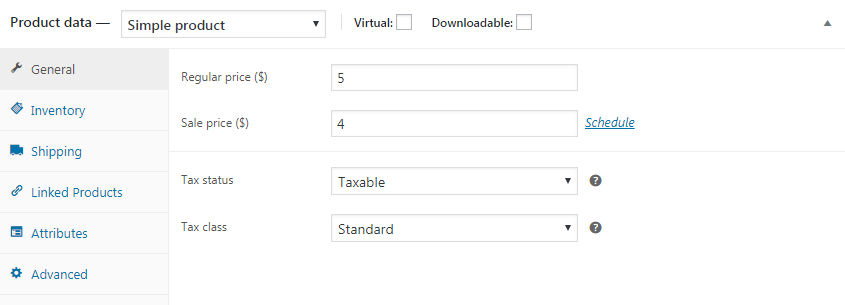
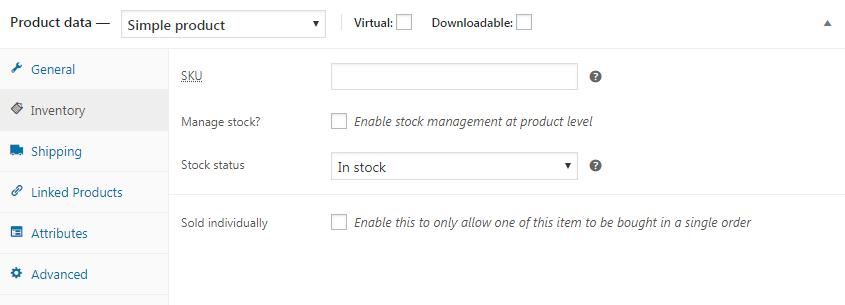
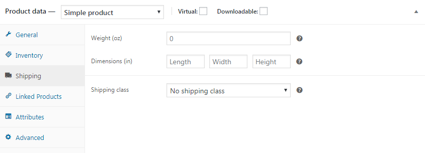
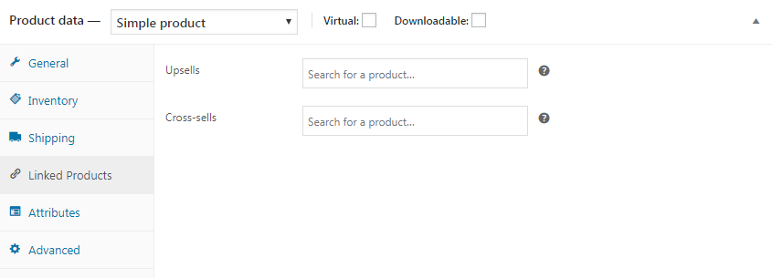
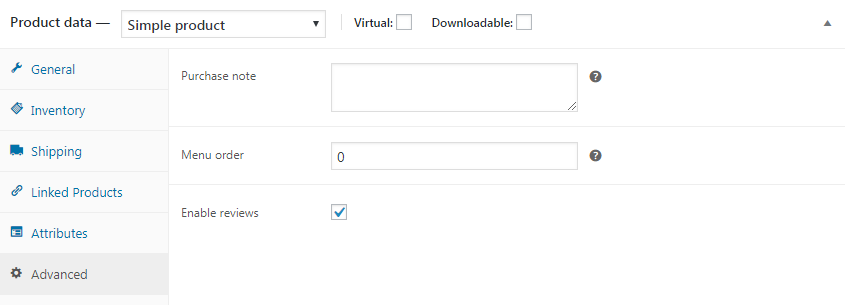

# Работа с данными о товаре

## General

Настройка цен и налогов

* **Regular price ($)** - обычная цена
* **Sale price ($)** - цена со скидкой. Опция **Schedule** позволяет выставить период отображения цены со скидкой.
* **Tax status** - использовать или нет расчёт налогов
* **Tax class** - налоговая ставка

## Inventory

Учёт количества товара на складе

* **SKU** - индентификатор продукта
* **Manage stock?** - нужно ли управлять наличием продуктов на складе. При активном пункте добавляется поле **Stock quantity** где вы можете указать количество товаров на складе и при покупке товара у вас автоматически будет уменьшатся это значение. Поле **Allow backorders?** позволяет разрешить возврат товара.
* **Stock status** - наличие на складе
* **Sold individually** - включите этот параметр, чтобы разрешить покупку только одного товара в одном заказе.

## Shipping

Эта информация потребуется для расчёта стоимости доставки

* **Weight (oz)** - вес товара
* **Dimensions (in)** - размеры товара
* **Shipping class** - вариант доставки

## Linked Products

Связанные товары, при грамотном использовании, позволят вам увеличивать продажи.

* **Upsells** - более дорогие товары такого же типа (с этим товаром также покупают)
* **Cross-sells** - товары связанные с текущим товаром (аксессуары)

## Advanced

Дополнительные настройки.

* **Purchase note** - примечание к покупке, будет выводится после того как клиент купит данный товар (не требуется в большинстве случаев)
* **Menu order** - позволит изменить порядок товаров в списке продуктов
* **Enable reviews** - активация отзывов

